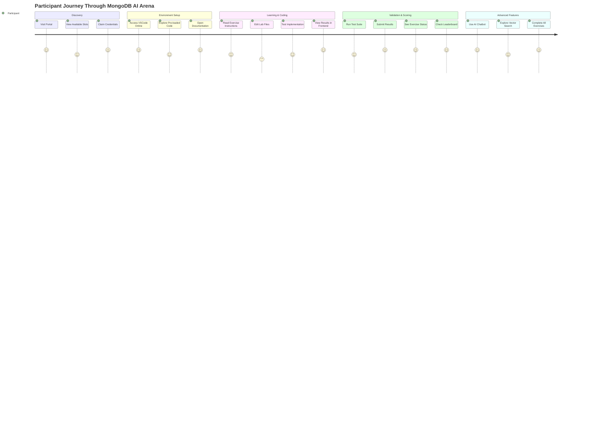
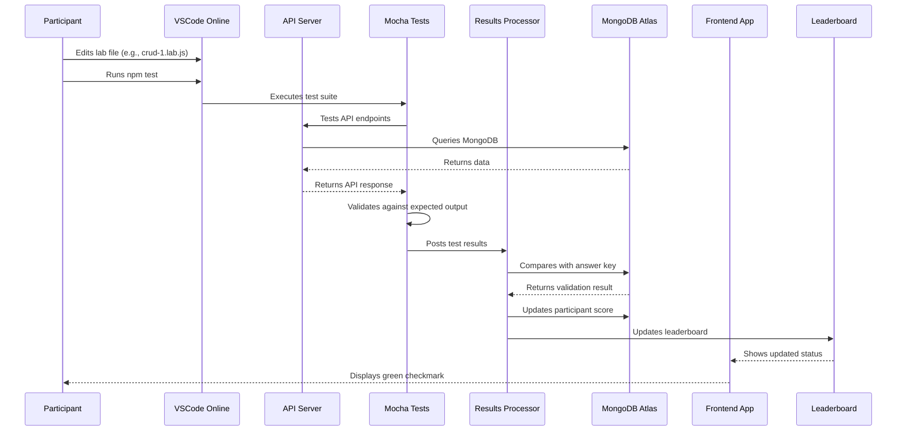
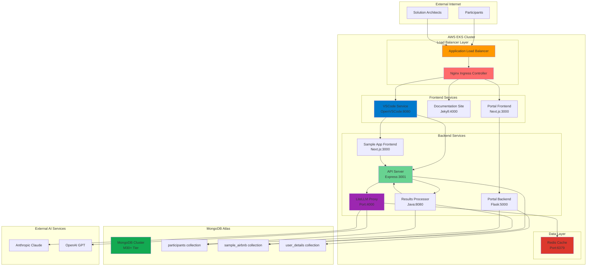
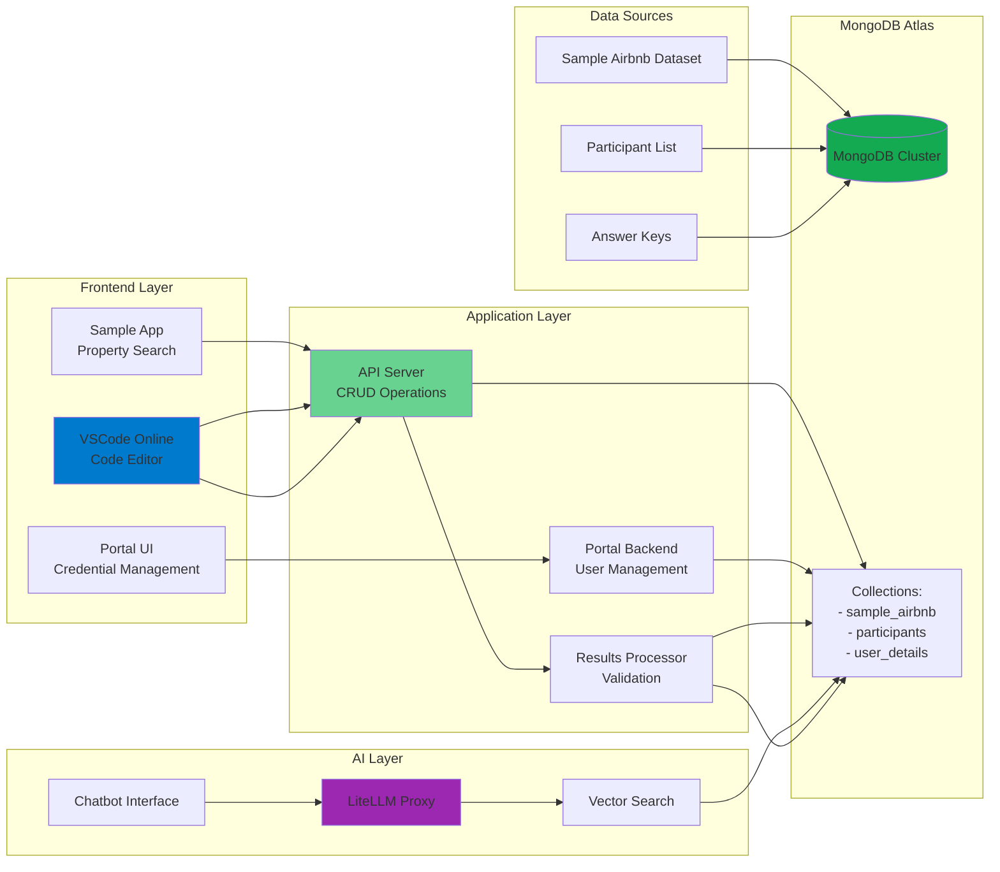
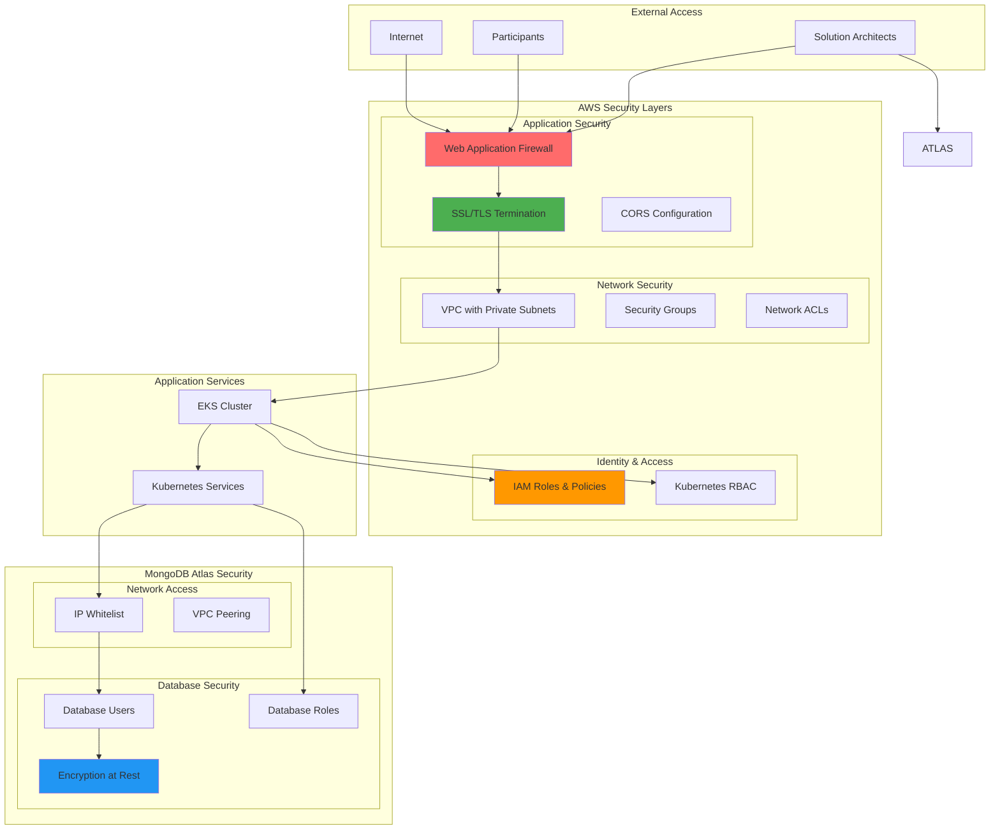

# MongoDB AI Arena - Architecture Diagrams

This document provides comprehensive architecture diagrams for the MongoDB AI Arena training platform, showing how all components work together to deliver a hands-on MongoDB learning experience.

## 1. High-Level System Architecture

This diagram shows the overall system architecture with all major components and their relationships.

```mermaid
graph TB
    subgraph "External Services"
        DNS[Route53 DNS]
        SSL[SSL Certificates]
        LLM[LLM Providers<br/>Claude/GPT]
    end

    subgraph "AWS Cloud"
        subgraph "EKS Cluster"
            subgraph "Core Services"
                NGINX[Nginx<br/>Reverse Proxy]
                PORTAL[Arena Portal<br/>Next.js + Flask]
                DOCS[Documentation<br/>Jekyll Site]
            end
            
            subgraph "Development Environment"
                VSCODE[VSCode Online<br/>OpenVSCode Server]
                APP[Sample App<br/>Next.js Frontend]
                SERVER[API Server<br/>Node.js/Express]
            end
            
            subgraph "AI & Processing"
                LITELLM[LiteLLM Proxy]
                REDIS[Redis Cache]
                RESULTS[Results Processor<br/>Java/Spring Boot]
            end
        end
        
        subgraph "MongoDB Atlas"
            ATLAS[MongoDB Cluster<br/>M30+ Tier]
            USERS[User Database<br/>Participants]
            SAMPLE[Sample Data<br/>Airbnb Dataset]
        end
    end

    subgraph "Participants"
        P1[Participant 1]
        P2[Participant 2]
        PN[Participant N]
    end

    subgraph "MongoDB SAs"
        SA[MongoDB Solution<br/>Architects]
    end

    %% External Access
    DNS --> NGINX
    SSL --> NGINX
    
    %% Participant Access
    P1 --> PORTAL
    P2 --> PORTAL
    PN --> PORTAL
    
    P1 --> VSCODE
    P2 --> VSCODE
    PN --> VSCODE
    
    %% SA Access
    SA --> ATLAS
    SA --> EKS
    
    %% Internal Routing
    NGINX --> PORTAL
    NGINX --> DOCS
    NGINX --> VSCODE
    
    %% VSCode Environment
    VSCODE --> APP
    VSCODE --> SERVER
    APP --> SERVER
    
    %% Database Connections
    SERVER --> ATLAS
    PORTAL --> ATLAS
    RESULTS --> ATLAS
    LITELLM --> REDIS
    
    %% AI Integration
    SERVER --> LITELLM
    LITELLM --> LLM
    
    %% Exercise Validation
    SERVER --> RESULTS
    RESULTS --> ATLAS
    
    %% Documentation
    DOCS --> VSCODE
    
    style ATLAS fill:#13aa52
    style EKS fill:#ff9900
    style PORTAL fill:#61dafb
    style VSCODE fill:#007acc
    style APP fill:#000000
    style SERVER fill:#68d391
```

## 2. Infrastructure Deployment Flow

This diagram shows the sequential deployment process using Terragrunt and Terraform.

```mermaid
flowchart TD
    START([SA runs terragrunt apply]) --> INIT[Initialize Terragrunt]
    
    INIT --> ATLAS_CONFIG[Configure Atlas Cluster]
    ATLAS_CONFIG --> ATLAS_CREATE[Create MongoDB Atlas Cluster]
    ATLAS_CREATE --> ATLAS_USERS[Create Database Users]
    ATLAS_USERS --> ATLAS_DATA[Load Sample Dataset]
    ATLAS_DATA --> ATLAS_INDEXES[Create Indexes]
    
    ATLAS_INDEXES --> EKS_CONFIG[Configure EKS Cluster]
    EKS_CONFIG --> EKS_CREATE[Create EKS Cluster]
    EKS_CREATE --> EKS_NODES[Create Worker Nodes]
    EKS_NODES --> EKS_NETWORK[Setup Networking]
    
    EKS_NETWORK --> HELM_INSTALL[Install Helm Charts]
    HELM_INSTALL --> NGINX_DEPLOY[Deploy Nginx]
    NGINX_DEPLOY --> PORTAL_DEPLOY[Deploy Arena Portal]
    PORTAL_DEPLOY --> DOCS_DEPLOY[Deploy Documentation]
    DOCS_DEPLOY --> VSCODE_DEPLOY[Deploy VSCode Online]
    VSCODE_DEPLOY --> LITELLM_DEPLOY[Deploy LiteLLM]
    LITELLM_DEPLOY --> REDIS_DEPLOY[Deploy Redis]
    REDIS_DEPLOY --> RESULTS_DEPLOY[Deploy Results Processor]
    
    RESULTS_DEPLOY --> DNS_CONFIG[Configure Route53]
    DNS_CONFIG --> SSL_CONFIG[Configure SSL Certificates]
    SSL_CONFIG --> COMPLETE([Deployment Complete])
    
    %% Styling
    style START fill:#e1f5fe
    style COMPLETE fill:#c8e6c9
    style ATLAS_CREATE fill:#13aa52
    style EKS_CREATE fill:#ff9900
    style HELM_INSTALL fill:#9c27b0
```

## 3. Participant Journey Flow

This diagram shows the complete user experience from first visit to completing exercises.

## 4. Exercise Validation Flow

This diagram shows how exercises are validated and scored automatically.

## 5. Component Network Architecture

This diagram shows the detailed network architecture and service communication patterns.

## 6. Data Flow Architecture

This diagram shows how data flows through the system during different operations.

## 7. Security Architecture

This diagram shows the security layers and access controls in the system.

## Key Architectural Principles

### 1. **Multi-Tenancy**
- Each customer gets their own isolated environment
- Separate MongoDB Atlas projects and EKS namespaces
- Configurable via `config.yaml` and `scenario.json`

### 2. **Scalability**
- Kubernetes-based auto-scaling
- MongoDB Atlas auto-scaling enabled
- Stateless application design

### 3. **Security**
- Network isolation with VPC and security groups
- Database access controls and encryption
- SSL/TLS termination at load balancer

### 4. **Observability**
- Centralized logging via Kubernetes
- Health checks and monitoring
- Exercise completion tracking

### 5. **Developer Experience**
- Pre-configured development environment
- Integrated testing and validation
- Real-time feedback and leaderboards

This architecture enables MongoDB Solution Architects to quickly spin up training environments for customers while providing participants with a seamless, hands-on learning experience.
