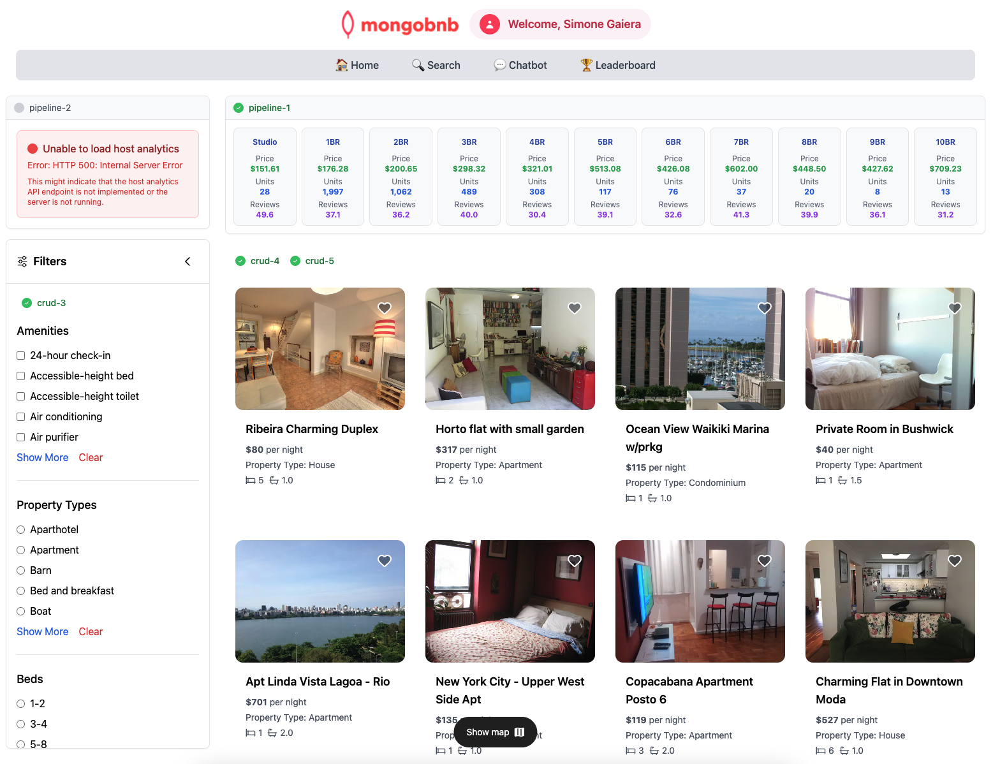

**Goal**: Create an aggregation pipeline to analyze the average price of listings based on the number of beds.

## Exercise: Aggregations

1. **Open the File**  
   Navigate to `server/src/lab/` and open `pipeline-1.lab.js`.

2. **Locate the Function**  
   Find the `aggregationPipeline` function.

3. **Update the Pipeline Array**  
   - **$match**: Filter for documents with both `beds` and `price` fields.  
   - **$group**: Group by number of beds and calculate average price.  
   - **$sort**: Sort by beds (ascending order).  
   - **$project**: Return only `beds` and `price` fields.  

### Exercise: Testing API Calls  
1. Go to `server/src/lab/rest-lab`.  
2. Open `pipeline-1-lab.http`.  
3. Click **Send Request** to call the API.  
4. Verify you receive the expected results.

### Exercise: Frontend Validation  
Select the "Show Statistics" checkbox to confirm the table displays the aggregated results.

