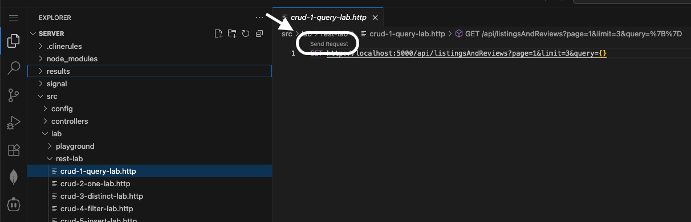

📋 Lab Reference

<strong>Associated Lab File:</strong> <code>crud-1.lab.js</code>

## 🚀 Goal: Find, Sort & Paginate Like a Pro

Your company’s journey into the short-term rental market has just begun, and the first challenge is clear: you need to help your users discover the perfect place to stay. As the backend engineer, it’s your job to make searching listings fast, accurate, and delightful.

In this exercise, you’ll master the basics of MongoDB by finding documents, sorting results, and adding smooth pagination to your queries. This is the foundation of every great rental platform—making sure guests can easily browse and explore what your company has to offer.

---

### 🧩 Exercise: Find Documents

1. **Open the File**  
   Head to `server/src/lab/` and open `crud-1.lab.js`.

2. **Locate the Function**  
   Find the `crudFind` function in the file.

3. **Shape the Query**  
   - Find all documents matching the provided `query` parameter.
   - Sort results by `_id` in ascending order.
   - Add pagination with:
     - `skip`: number of documents to skip
     - `limit`: maximum documents to return

---

### 🚦 Test Your API

1. Go to `server/src/lab/rest-lab`.
2. Open `crud-1-query-lab.http`.
3. Click **Send Request** to execute the API call.

4. Check that the response returns the paginated results.

---

### 🖥️ Frontend Validation

Once your backend logic is in place, refresh the homepage and watch as your listings appear—ready for your future guests to explore. Scroll through the results and see pagination in action: smooth, fast, and just how users love it.

**Check Exercise Status:**  
Go to the app and check if the exercise toggle shows green, indicating your implementation is correct.

With this first step, you’re not just writing code—you’re building the search experience that will help your company stand out in the rental market.  
**Ready to help your users find their next stay? Let’s get started!**

