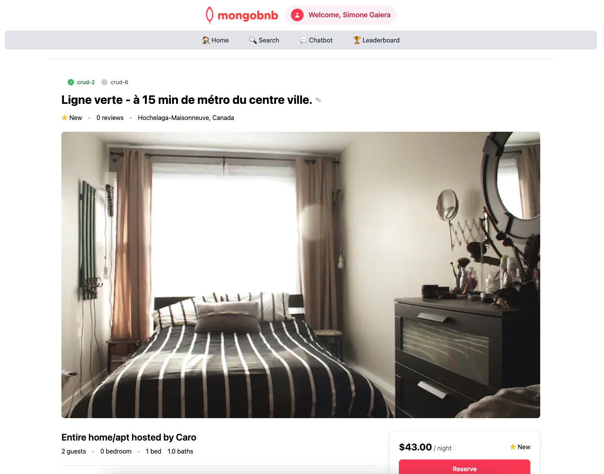

📋 Lab Reference

<strong>Associated Lab File:</strong> <code>crud-2.lab.js</code>

## 🚀 Goal: Instantly Retrieve a Single Document

Your platform is growing, and now your users want more than just a list—they want details! Imagine a guest clicking on a property to see every photo, amenity, and review. As the backend engineer, it’s your job to deliver that information instantly and accurately.

In this exercise, you’ll unlock the power of MongoDB’s `findOne` to fetch exactly what your users need, right when they need it. This is the magic behind every detail page—making sure guests can dive deep into any listing with a single click.

---

### 🧩 Exercise: Find One Document

1. **Open the File**  
   Navigate to `server/src/lab/` and open `crud-2.lab.js`.

2. **Locate the Function**  
   Find the `crudOneDocument` function in the file.

3. **Shape the Query**  
   - Implement the function to find one document where `_id` equals the provided `id` parameter.
   - Return the complete document that matches this criteria.

---

### 🚦 Test Your API

1. Go to `server/src/lab/rest-lab`.
2. Open `crud-2-one-lab.http`.
3. Click **Send Request** to execute the API call.
4. Verify the response returns the single document you requested.
5. **Check Exercise Status:**  
   Go to the app and check if the exercise toggle shows green, indicating your implementation is correct.

---

### 🖥️ Frontend Validation

Select a listing in the app and watch as all the details for that property appear—fast, focused, and flawless. This is the experience that keeps guests coming back, and it all starts with your code.

With this step, you’re not just retrieving data—you’re bringing each listing to life for your users.  
**Ready to deliver the details that make your platform shine? Let’s get started!**

