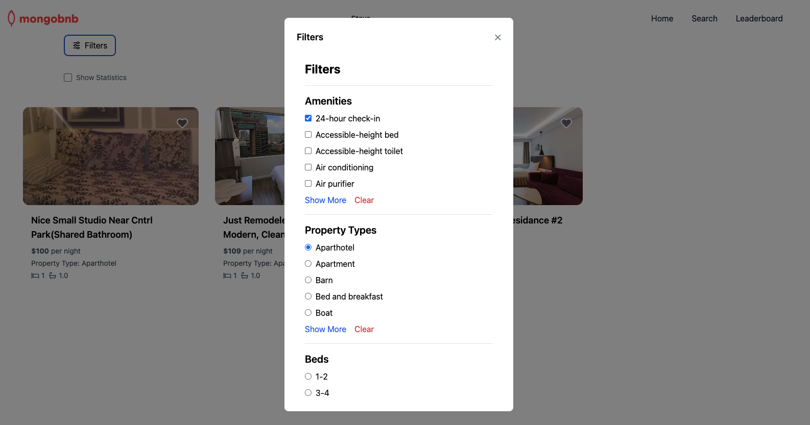

In this section, you will learn how to perform basic find operations in MongoDB. You will be required to complete the code snippets to achieve the desired results.

## Exercise: Find Documents

**Objective** 
In this exercise, you will be required to find documents given a query.

**Pipeline Definition**  

1. **Navigate to the File**: In the `lab` folder open `crud-4.lab.js`.
2. **Modify the Function**: Locate and modify the `crudFilter` function.
3. **Update the Code**:
    - You are given a set of query inputs:
        - `amenities`: an array of ammenities selected in the application
        - `propertyType`: the property_type selected in the application
        - `beds`: the range of required beds. Example: 2-3, 4-7, ...
    - You are given a set of additional inputs:
        - `skip`: the page to skip for pagination
        - `limit`: the number of documents returned
    - You are asked to complete the code to find all the documents for the specific query inputs
    - Not all the query items are passed by the application at a given time
    - If no query items are passed you should return all the document for the given page and limit

### Exercise: Testing API Calls

1. Navigate to the directory: `server/lab/rest-lab`.
2. Open the file named `crud-4-lab.http`.
3. In the file, locate and click the `Send Request` link to execute the API call.
4. Verify that the endpoint is returning the expected results.

### Exercise: Frontend validation
Select "Filters", and validate that listings are changing based on your selection.

