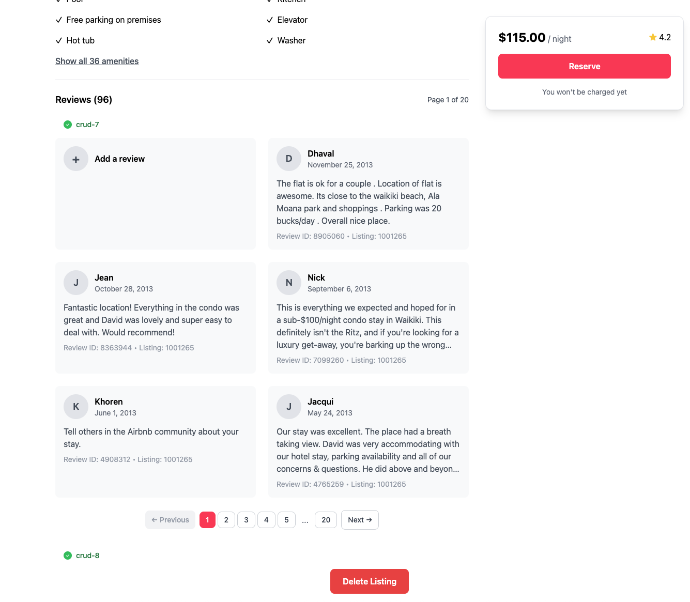

📋 Lab Reference

<strong>Associated Lab File:</strong> <code>crud-8.lab.js</code>

## 🚀 Goal: Delete Documents Like a Pro

Your platform is thriving, but sometimes it’s time to say goodbye—maybe a listing is no longer available, or a guest wants their data removed. As the backend engineer, you ensure your platform stays clean, relevant, and trustworthy by handling deletions quickly and safely.

In this exercise, you’ll master the art of deleting documents by their ID. With MongoDB, you’ll keep your data fresh and your users confident that their information is always up to date.

---

### 🧩 Exercise: Delete One Document

1. **Open the File**  
   Navigate to `server/src/lab/` and open `crud-8.lab.js`.

2. **Locate the Function**  
   Find the `crudDelete` function in the file.

3. **Update the Code**  
   - Implement code to delete a document where `_id` equals the provided `id` parameter.

---

### 🚦 Test Your API

1. Go to `server/src/lab/rest-lab` directory.
2. Open `crud-8-delete-lab.http`.
3. Click **Send Request** to execute the API call.
4. Verify the response confirms successful deletion.

---

### 🖥️ Frontend Validation

Select "Delete Listing" in the app and watch the record vanish instantly—clean, smooth, and oh-so-satisfying! This is how you keep your platform tidy and your users in control.

**Check Exercise Status:**  
Go to the app and check if the exercise toggle shows green, indicating your implementation is correct.

With this step, you’re not just removing data—you’re building trust and keeping your platform running at its best.  
**Ready to keep your data clean? Let’s get started!**

