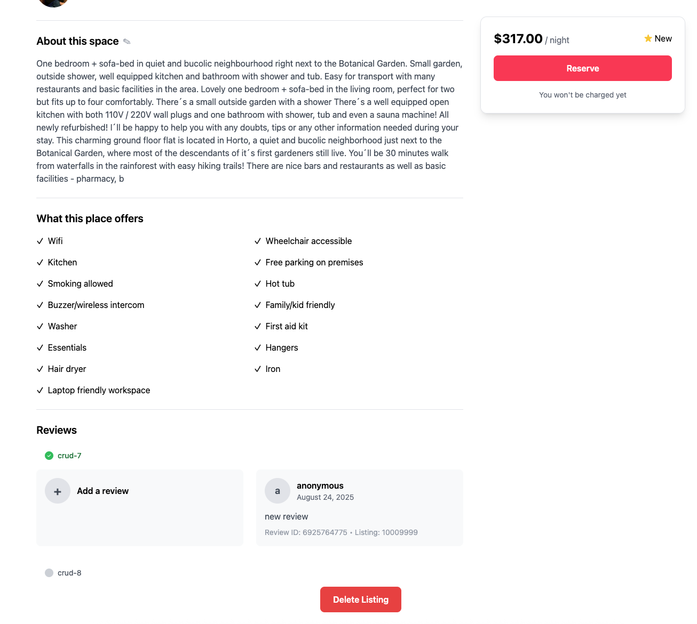

In this section, you will learn how to perform a basic delete operation in MongoDB.

## Exercise: Delete One Document

**Objective**  
You are required to delete the document whose `_id` matches the `id` provided.

**Pipeline Definition**  
1. **Navigate to the File**  
   Open `crud-8.lab.js` located in the `/server/lab/` folder.  
2. **Modify the Function**  
   Locate and modify the `crudDelete` function.  
3. **Update the Code**  
   - Delete the document with `_id` equal to `id`.

### Exercise: Testing API Calls
1. Navigate to `server/lab/rest-lab`.  
2. Open `crud-8-lab.http`.  
3. Click **Send Request** to run the API call.  
4. Verify that the document is successfully removed.

### Exercise: Frontend validation
Delete a listing by selecting "Delete Listing" in the application and confirm the record is removed.

