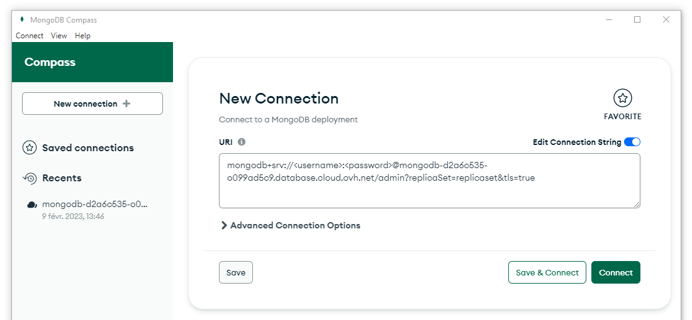

## Environment Preparation: Atlas

Before you begin, it's essential to ensure that you can access your environment. 
Follow these steps to validate your setup:

1. **Obtain Your MongoDB Atlas Connection String**: You will receive a connection string to connect to your MongoDB Atlas cluster.
2. **Database Access Credentials**: You will be provided a username and password for database access.
3. **Atlas Access Credentials (Optional)**: While not mandatory, you may receive additional credentials for accessing the MongoDB Atlas interface.

### Environment Validation: Compass (Skip if not available)

To validate your environment, you can test your credentials using MongoDB Compass. 
If you haven't installed Compass yet, download it from [here](https://www.mongodb.com/try/download/compass).

Steps to Validate Your Connection with Compass:

1. **Open MongoDB Compass**: Launch the application after installation.
2. **Enter Your Connection String**: Paste the connection string into the provided field in Compass.
3. **Input Your Credentials**: Enter the username and password provided to you.
4. **Connect**: Click the "Connect" button to establish a connection to your Atlas cluster.

If the connection is successful, you will be able to view your databases and collections in Compass. If you encounter any issues, double-check your connection string and credentials.

---

## Self-Paced: Create an Atlas Cluster

If you prefer a self-paced approach, you can create your own Atlas cluster and load the Sample Dataset. Follow the [MongoDB Atlas documentation](https://www.mongodb.com/docs/atlas/getting-started/) for detailed instructions on creating a cluster and loading sample data.
