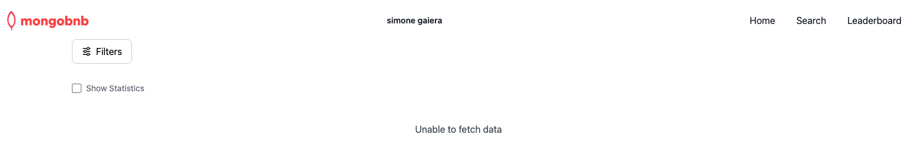

## Environment Preparation: VSCode Online

This guide helps you configure your VSCode Online environment and connect your application to MongoDB for a smooth development experience.

---

### Step 1: Backend Setup

1. **Access VSCode Online:**
   - Open your VSCode environment with the URL pattern below:
     ```
     https://<username>.<customer>.mongogameday.com/
     ```
   - Open the `Explorer` and click **Open Folder**.
   - Navigate to:
     ```
     /home/workspace/mongodb-airbnb-workshop/
     ```
     and click **Ok**.
      
   - When prompted, select **Yes, trust the author**.
    

2. **Start the Server:**
   - Open a new terminal using:
     ```
     ☰ > Terminal > New Terminal
     ```
   - Change to the server directory and start the server:
     ```bash
     cd server
     npm start
     ```
   - Verify that the server is running and connected to MongoDB by checking the console logs.

---

### Step 2: Frontend Setup

1. **Launch the Frontend:**
   - Open your application’s frontend using:
     ```
     https://<username>.<customer>.mongogameday.com/app/
     ```
   - Confirm that your name appears on the homepage.

   

---

### Step 3: Connect the MongoDB Extension

1. **Obtain the Connection String:**  
   - Open the `/server/.env` file and copy the MongoDB connection string:  
     ```markdown  
     MONGODB_URI=**mongodb+srv://<username>:<password>@<cluster>.mongodb.net**/?retryWrites=true&w=majority  
     ```

2. **Establish the Connection:**
   - In VSCode, click on the **MongoDB extension** in the sidebar.
   - In the **CONNECTIONS** section, click the **+** button to add a connection.
   - Select **Connect with Connection String**.
   - Paste your copied connection string. For example:
     ```
     mongodb+srv://<username>:<password>@<cluster>.mongodb.net
     ```

3. **Verify the Connection:**
   - Ensure that the connection is successful by checking for any error messages in VSCode.

---

### Troubleshooting

- **Server Issues:**  
  If you encounter issues starting the server, recheck your terminal commands and ensure you’re in the correct directory.

- **Further Support:**  
  If problems persist, contact your SA for additional assistance.

Happy coding!
