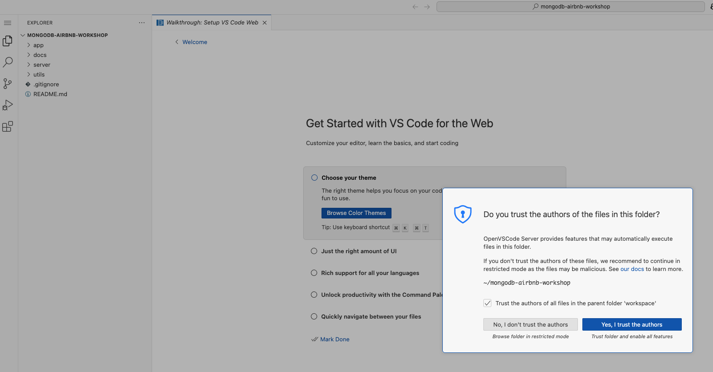

# 🌐💡 VSCode Online: Your Cloud Playground

Welcome to your cloud-powered dev playground!  
Let’s get you connected, coding, and exploring MongoDB in style.

---

## 🚀 Step 1: Backend Setup

1. **Access VSCode Online:**
   - Open your VSCode environment:
     ```
     https://<username>.<customer>.mongogameday.com/
     ```
   - In the `Explorer`, click **Open Folder** and navigate to:
     ```
     /home/workspace/mongodb-airbnb-workshop/
     ```
     Click **Ok**.
       
   - When prompted, select **Yes, trust the author**.
     

2. **Start the Server:**
   - Open a new terminal:
     ```
     ☰ > Terminal > New Terminal
     ```
   - Fire up the backend:
     ```bash
     cd server
     npm start
     ```
   - Check the console logs—if you see a MongoDB connection message, you’re golden!

---

## 🎨 Step 2: Frontend Setup

1. **Launch the Frontend:**
   - Open your app in the browser:
     ```
     https://<username>.<customer>.mongogameday.com/app/
     ```
   - See your name on the homepage? You’re in!
     

---

## 🔗 Step 3: Connect the MongoDB Extension

1. **Grab Your Connection String:**  
   - Open `/server/.env` and copy your MongoDB URI:
     ```
     MONGODB_URI=mongodb+srv://<username>:<password>@<cluster>.mongodb.net/?retryWrites=true&w=majority
     ```

2. **Connect in VSCode:**
   - Click the **MongoDB extension** in the sidebar.
   - In **CONNECTIONS**, hit the **+** and choose **Connect with Connection String**.
   - Paste your URI and connect!

3. **Success Check:**
   - If you see your databases, you’re ready to roll!

---

## 🛠️ Troubleshooting

- **Server not starting?**  
  Double-check your terminal commands and directory.

- **Still stuck?**  
  Ping your SA for help—no shame in asking!

---

✨ That’s it! You’re set to code, create, and explore.  
Happy hacking!
