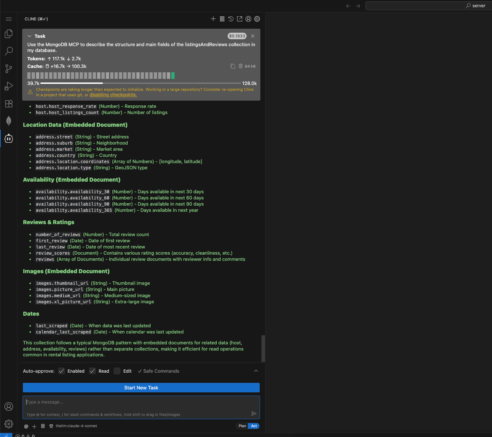

## 🧪 Understanding Your MongoDB Collection

Before you start querying or building features, it’s important to know **what’s inside your database**.

For this workshop, you’ll be working with the `listingsAndReviews` collection. Let’s explore its structure so you know what data you have and how to use it!

---

### 🤖 Use Cline + MongoDB MCP

We’ll use **Cline** and the **MongoDB MCP** to quickly describe the structure of your collection.

#### 1. Open Cline in VSCode

- Click the **Cline** icon in the VSCode sidebar to open the chat panel.

#### 2. Paste This Prompt

**⬇️ Copy and paste this prompt into Cline:**

> Use the MongoDB MCP to describe the structure and main fields of the `listingsAndReviews` collection in my database.

#### 3. Review the Response

- Cline will analyze your collection and return a summary of the main fields, their types, and example values.
- Look for:
  - **Top-level fields** (e.g., `name`, `address`, `reviews`)
  - **Nested fields** (e.g., `address.street`, `reviews.rating`)
  - **Data types** (string, number, array, object, etc.)

---

### 📚 Learn More

- [MongoDB MCP Documentation](https://www.mongodb.com/docs/mcp-server/overview/?client=claude&deployment-type=atlas)

---

### 📝 What to Do Next

- **Take Notes:** Jot down interesting fields or structures you might want to use.
- **Ask Follow-ups:** Try prompts like:
  - “Show me a sample document from `listingsAndReviews`.”
  - “What are the most common values for the `property_type` field?”
  - “List all array fields in this collection.”

---

**Tip:**  
Exploring your collection’s structure now will save you time and help you write better queries later. Knowing your data well is key to unlocking its value!
