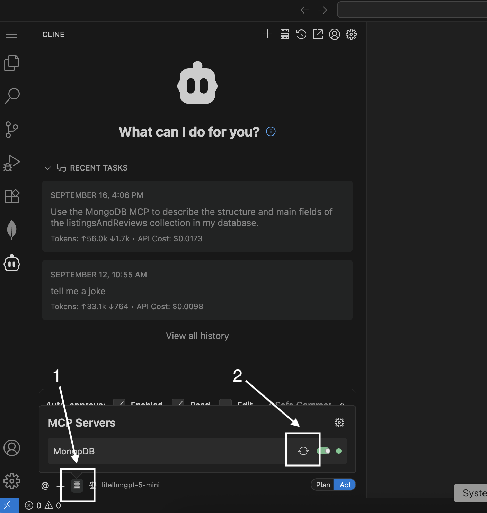

## 🧪 Understanding Your MongoDB Collection

Before you start querying or building features, it’s important to know **what’s inside your database**.

For this workshop, you’ll be working with the `listingsAndReviews` collection. Let’s explore its structure so you know what data you have and how to use it!

---

### 🤖 Use Cline + MongoDB MCP

We’ll use **Cline** and the **MongoDB MCP** to quickly describe the structure of your collection.

#### 1. Open Cline in VSCode

- Click the **Cline** icon in the VSCode sidebar to open the chat panel.

#### 2. Paste This Prompt

**📋 Prompt:** Copy and paste this into Cline:

> Use the MongoDB Arena MCP Server to describe the structure and main fields of the listingsAndReviews collection in my database. List all the databases and collections available to me first.

**⚠️ Note:** If you encounter any issues, try refreshing the MCP.

#### 3. Review the Response

- Cline will analyze your collection and return a summary of the main fields, their types, and example values.
- Look for:
  - **Top-level fields** (e.g., `name`, `address`, `reviews`)
  - **Nested fields** (e.g., `address.street`, `reviews.rating`)
  - **Data types** (string, number, array, object, etc.)

---

### 📚 Learn More

- [MongoDB MCP Documentation](https://www.mongodb.com/docs/mcp-server/overview/?client=claude&deployment-type=atlas)

---

**Tip:**  
Exploring your collection’s structure now will save you time and help you write better queries later. Knowing your data well is key to unlocking its value!


