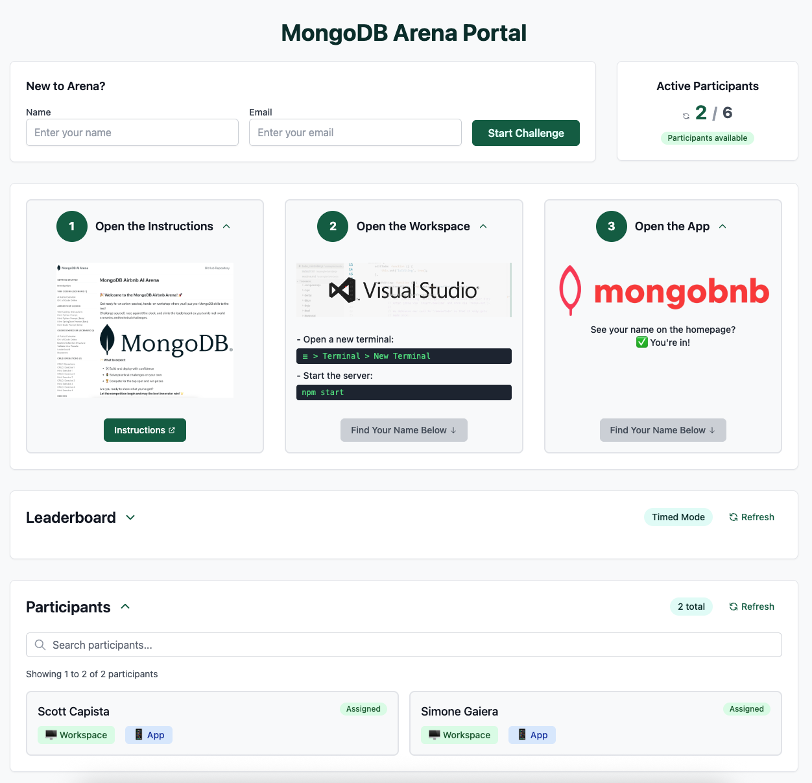
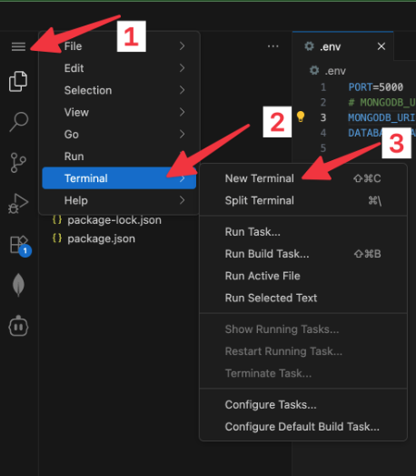

## 🌐💡 VSCode Online: Your Cloud Playground

Welcome to your cloud-powered dev playground!  
Let’s get you connected, coding, and exploring MongoDB in style.

**We’re here to _vibe code_ this experience together—let’s make it unforgettable! 🚀🎶**

---

## 🚀 Step 1: Backend Setup

1. **Access VSCode Online:**
   - Navigate to the Arena Portal and verify your name appears in the participant list. If it’s not there, complete the "New to Arena?" form.
   - Open the `Workspace`
       
2. **Trust the Workspace:**
   - When prompted:
     - Click **Yes, I trust the author**
     - Click **Mark Done**
   

3. **Start the Server:**
   - Open a new terminal:
     ```
     ☰ > Terminal > New Terminal
     ```
     
   - Fire up the backend:
     ```bash
     npm start
     ```
   - ✅ **Check:** If you see a MongoDB connection message in the logs, you’re good to go!

---

## 🎨 Step 2: Frontend Setup

1. **Launch the App:**
   - Navigate to the Arena Portal and open the `App`

2. **Validate the Frontend:**    
   - See your name on the homepage? ✅ You’re in!
   

   - If you see the error message instead of your name, double-check that your backend server is running.
   
   - Still not working? Call your SA for help!

---

## 🤖 Step 4: Supercharge VSCode with Cline

1. **Launch Cline:**  
   - Click the **Cline** icon in the VSCode toolbar to open the extension.
   - Choose **Use your own API key** when prompted.
   
2. **Configure the API:**
   - Set **API Provider** to **LiteLLM**.
   - Enter the following LiteLLM settings:
     - **Base URL:** `http://litellm-service:4000`
     - **API Key:** `noop`
     - **Model:** `gpt-5-mini`
   - Click **Let's go!**  
     

3. **Test Cline:**
   - Test your setup by entering a prompt in Cline (for example, ask it to tell you a joke).
     

**Tip:**  
If you don’t get a response, double-check your API settings or ask your SA for help!


