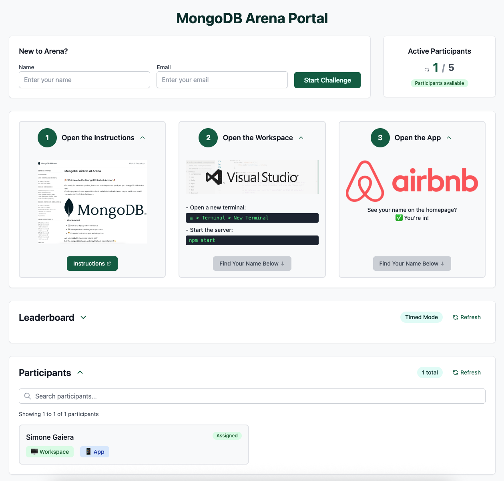
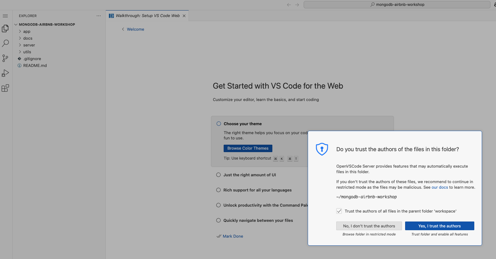
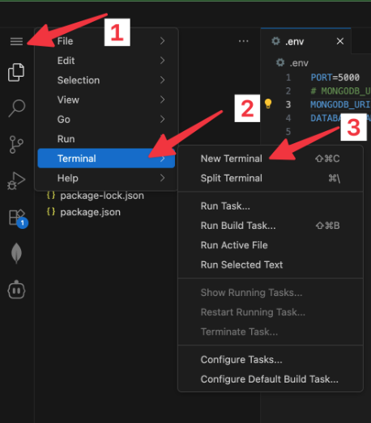
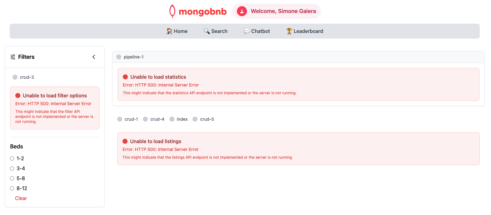
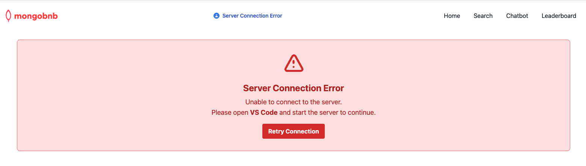
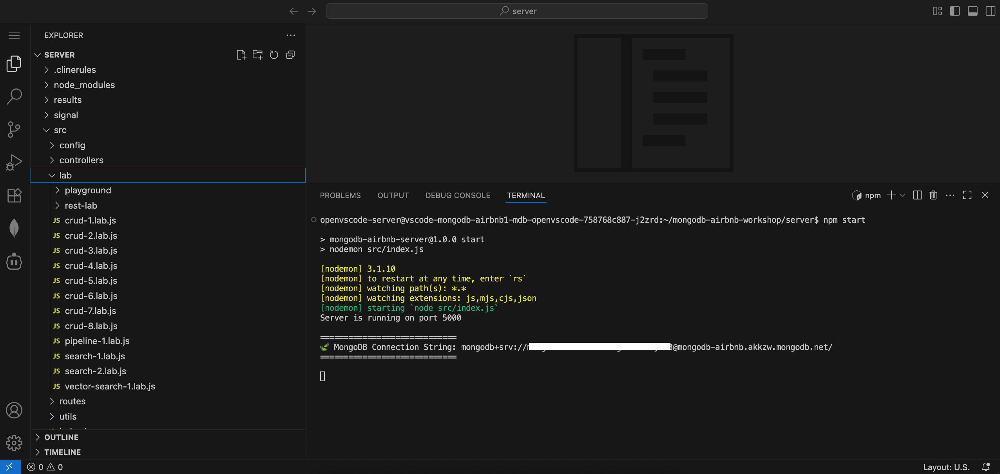
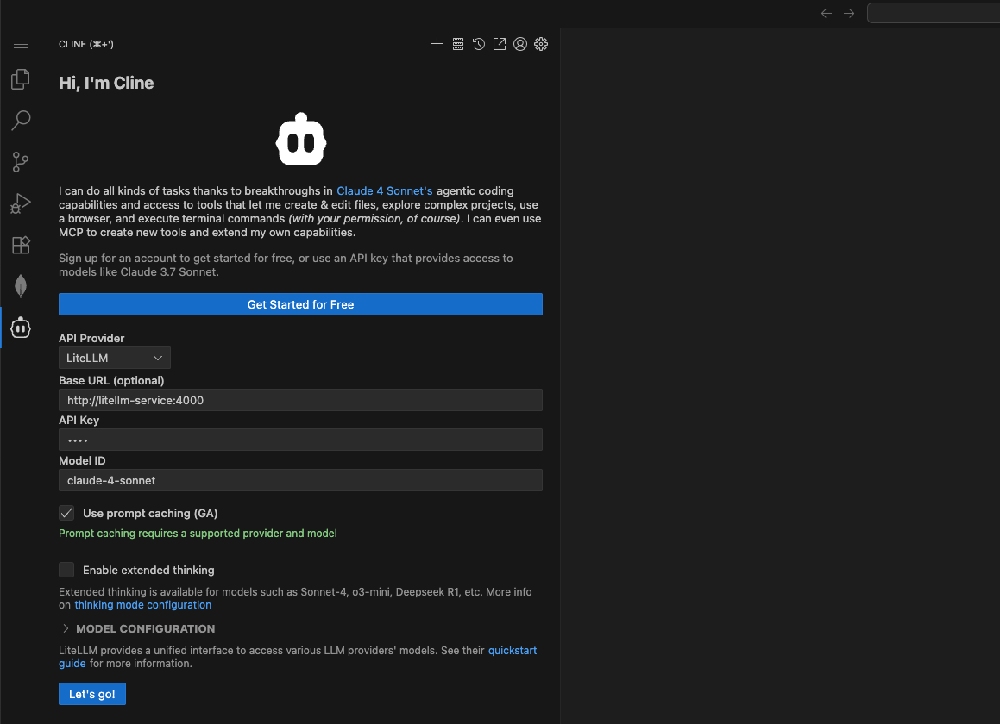
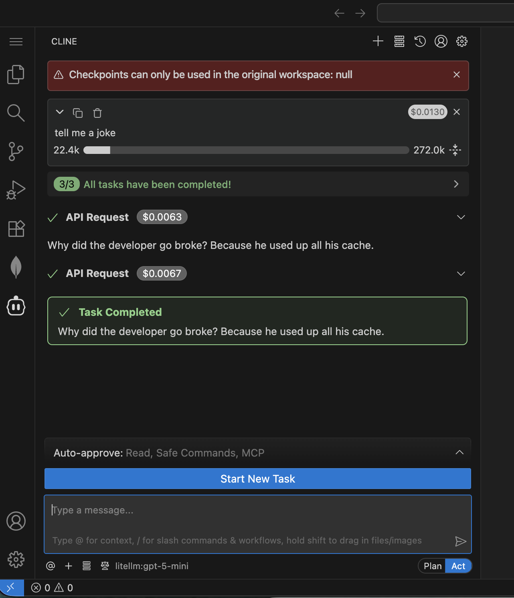

## 🌐💡 VSCode Online: Your Cloud Playground

Welcome to your cloud-powered dev playground!  
Let’s get you connected, coding, and exploring MongoDB in style.

**We’re here to _vibe code_ this experience together—let’s make it unforgettable! 🚀🎶**

---

## 🚀 Step 1: Backend Setup

1. **Access VSCode Online:**
   - Navigate to the Arena Portal and verify your name appears in the participant list. If it’s not there, complete the "New to Arena?" form.
   - Open the `Workspace`
       
2. **Trust the Workspace:**
   - When prompted:
     - Click **Yes, I trust the author**
     - Click **Mark Done**
   

3. **Start the Server:**
   - Open a new terminal:
     ```
     ☰ > Terminal > New Terminal
     ```
     
   - Fire up the backend:
     ```bash
     npm start
     ```
   - ✅ **Check:** If you see a MongoDB connection message in the logs, you’re good to go!

---

## 🎨 Step 2: Frontend Setup

1. **Launch the App:**
   - Navigate to the Arena Portal and open the `App`

2. **Validate the Frontend:**    
   - See your name on the homepage? ✅ You’re in!
   

   - If you see the error message instead of your name, double-check that your backend server is running.
   
   - Still not working? Call your SA for help!

---

## 🔗 Step 3: Connect the MongoDB Extension

1. **Grab Your Connection String:**  
   - After starting your backend server (`npm start`), you'll see the connection string displayed in the terminal output.
   - **Copy** the entire connection string from the terminal.
     ```markdown
     =============================
      🍃 MongoDB Connection String: `mongodb+srv://credentials@cluster.mongodb.net/`
     =============================
     ```
   

2. **Connect in VSCode:**
   - Click the **MongoDB extension** in the sidebar.
   - In **CONNECTIONS**, hit the **+** and choose **Connect with Connection String**.
   - **Paste** your copied URI and connect!

3. **Success Check:**
   - If you see your databases, you’re ready to roll!

## 🔗 Step 4: Use MongoDB Playground

1. **Open the MongoDB Playground:**  
   - In VSCode Online, locate and open the file `find-playground.mongodb.js` (usually found in the bottom left of the Explorer).
   

2. **Run Your First Query:**  
   - Click the **Play** ▶️ button at the top right of the editor to execute the playground script.

3. **Check the Results:**  
   - If your query runs successfully and returns data from your database, you’re all set!
   - If you see errors, double-check your database name and connection.

## 🤖 Step 5: Supercharge VSCode with Cline

1. **Launch Cline:**  
   - Click the **Cline** icon in the VSCode toolbar to open the extension.
   - Choose **Use your own API key** when prompted.

2. **Configure the API:**
   - Set **API Provider** to **LiteLLM**.
   - Enter the following LiteLLM settings:
     - **Base URL:** `http://litellm-service:4000`
     - **API Key:** `noop`
     - **Model:** `gpt-5-mini`
     - ⚠️ Select **Use Prompt Caching (GA)**
     - ⚠️ Unselect **Enable Thinking** if it is enabled
   - Click **Let's go!**  
     

3. **Test Cline:**
   - Test your setup by entering a prompt in Cline (for example, ask it to tell you a joke).
     

**Tip:**  
If you don’t get a response, double-check your API settings or ask your SA for help!


