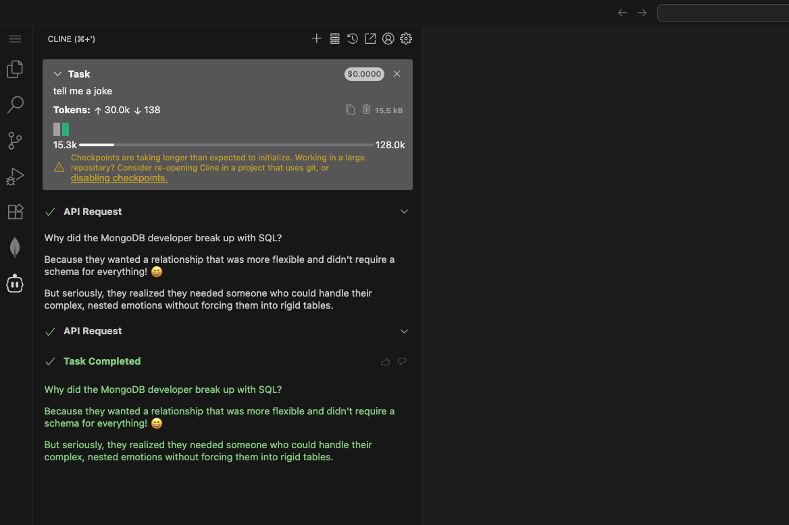

## 🌐💡 VSCode Online: Your Cloud Playground

Welcome to your cloud-powered dev playground!  
Let’s get you connected, coding, and exploring MongoDB in style.

**Quick Check**: Navigate to `https://<customer>.mongogameday.com/` and verify your name appears in the participant list. If it’s not there, please ask your SA before proceeding.

---

## 🚀 Step 1: Backend Setup

1. **Access VSCode Online:**
   - Navigate to `https://<customer>.mongogameday.com/` and verify your name appears in the participant list. If it’s not there, please ask your SA before proceeding.
       
2. **Trust the Workspace:**
   - When prompted:
     - Click **Yes, I trust the author**
     - Click **Mark Done**
  

3. **Start the Server:**
   - Open a new terminal:
     ```
     ☰ > Terminal > New Terminal
     ```
   - Fire up the backend:
     ```bash
     cd server
     npm start
     ```
   - ✅ **Check:** If you see a MongoDB connection message in the logs, you’re good to go!

---

## 🎨 Step 2: Frontend Setup

1. **Launch the App:**
> **Note:** You can use the default customer page to access your frontend
   - Open your app in the browser:
     ```
     https://<username>.<customer>.mongogameday.com/app/
     ```
2. **Validate the App:**    
   - See your name on the homepage? ✅ You’re in!
   
   - If you see the message **Stays** instead of your name, double-check that your backend server is running.
   - Still not working? Call your SA for help!

---

## 🔗 Step 3: Connect the MongoDB Extension

1. **Grab Your Connection String:**  
   - Open `/server/.env` and copy your MongoDB URI:
     ```markdown
     MONGODB_URI=`mongodb+srv://<username>:<password>@<cluster>.mongodb.net`/?retryWrites=true&w=majority
     ```

2. **Connect in VSCode:**
   - Click the **MongoDB extension** in the sidebar.
   - In **CONNECTIONS**, hit the **+** and choose **Connect with Connection String**.
   - Paste your URI and connect!

3. **Success Check:**
   - If you see your databases, you’re ready to roll!

## 🔗 Step 4: Use MongoDB Playground

1. **Open the MongoDB Playground:**  
   - In VSCode Online, locate and open the file `mongodb-playground.mongodb.js` (usually found in the bottom left of the Explorer).
   

2. **Set Your Database:**  
   - Find the line:
     ```js
     airbnb_database = 'sample_airbnb';
     ```
   - Replace `'sample_airbnb'` with your own database name:
     ```js
     airbnb_database = '<username>';
     ```

3. **Run Your First Query:**  
   - Click the **Play** ▶️ button at the top right of the editor to execute the playground script.

4. **Check the Results:**  
   - If your query runs successfully and returns data from your database, you’re all set!
   - If you see errors, double-check your database name and connection.

## 🤖 Step 5: Supercharge VSCode with Cline

1. **Launch Cline:**  
   - Click the **Cline** icon in the VSCode toolbar to open the extension.
   - Choose **Use your own API key** when prompted.

2. **Configure the API:**
   - Set **API Provider** to **LiteLLM**.
   - Enter the following LiteLLM settings:
     - **Base URL:** `http://litellm-service:4000`
     - **API Key:** `noop`
     - **Model:** `claude-4-sonnet`
     - Select **Use Prompt Caching:**
   - Click **Let's go!**  
     

3. **Save and Test:**
   - Click **Save** to apply your settings.
   - Test your setup by entering a prompt in Cline (for example, ask it to tell you a joke).
     

**Tip:**  
If you don’t get a response, double-check your API settings or ask your SA for

### 🧪 Test: Explore Collection Structure with MongoDB MCP

**Try this in Cline:**  
Copy and paste the following prompt into Cline to explore your collection:

> Use the MongoDB MCP to describe the structure and main fields of the `listingsAndReviews` collection in my database.

**Check the response in Cline to see the main fields and their descriptions.**
