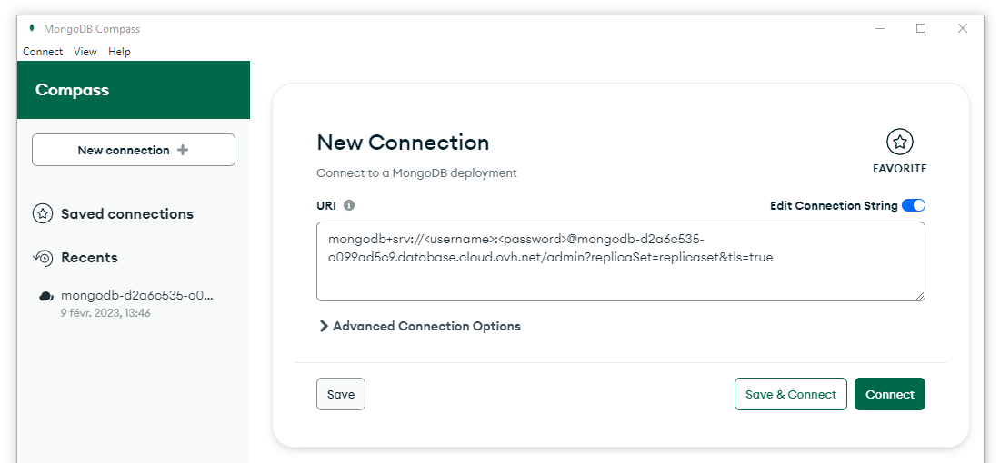

## 🚀 Get Ready: MongoDB Atlas Environment

Welcome! Let’s get your MongoDB Atlas environment up and running in style.  
Here’s what you’ll need:

- **A MongoDB Atlas cluster**
- **Database access credentials** (username & password)
- **A connection string** for your database
- **MongoDB Compass** (the GUI for MongoDB)

---

## ✅ Quick Start: Validate Your Environment

**Attending a workshop?**  
Your instructor will provide everything you need!

### 1️⃣ Install MongoDB Compass

- [Download MongoDB Compass](https://www.mongodb.com/try/download/compass) and install it.

### 2️⃣ Connect to Atlas

- Open Compass.
- Paste the connection string from your instructor.
- Replace `<username>` and `<password>` with your credentials.
- Hit **Connect**!

### 3️⃣ Success Check

- If you see databases in the left panel, you’re in!
- Look for the Airbnb sample dataset collections.

---

## 🛠️ Self-Paced Setup: Create Your Own Atlas Cluster

**Going solo?** No problem—follow these steps:

### 🌟 Create Your Atlas Cluster

1. [Sign up or log in to MongoDB Atlas](https://www.mongodb.com/cloud/atlas)
   - The free tier is perfect for this workshop!

2. **Load the Sample Dataset**
   - Use the Atlas UI to load the sample data, or import your own.
   - Grab your new credentials and connection string.

---

🎉 **You’re all set!**  
If you hit any snags, double-check your credentials or reach out for help.

Happy exploring with MongoDB Atlas!
