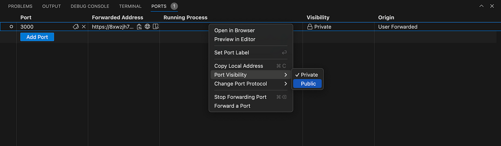

## 💻✨ Cursor/VSCode Setup

Ready to dive into the [mongodb-airbnb-workshop](https://github.com/simonegaiera/mongodb-airbnb-workshop)?  
Let's get your environment up and running—fast, smooth, and with style!

---

## 📋 Prerequisites

Before you begin, make sure you have:
- **Node.js LTS** installed on your system ([Download here](https://nodejs.org/))

---

## 🛠️ Step 1: Clone the Repository

1. Open your terminal.
2. Clone the repository:
   ```bash
   git clone https://github.com/simonegaiera/mongodb-airbnb-workshop.git
   ```
3. Navigate into the project folder:
   ```bash
   cd mongodb-airbnb-workshop
   ```

> **Pro Tip:**  
> Once loaded, you’ll see two folders:  
> - `app` (the frontend)  
> - `server` (the backend)

---

## 🧩 Step 2: Power Up VSCode

Supercharge your workflow with these extensions:
- **MongoDB for VS Code**
- **REST Client**

---

## 🔥 Step 3: Backend Server Magic

1. In `server`, create a `.env` file from `.env.template`.
2. Paste your MongoDB connection string (basic setup):
   ```
   PORT=5000
   MONGODB_URI=mongodb+srv://credentials@cluster.vrkei.mongodb.net/?retryWrites=true&w=majority
   DATABASE_NAME=sample_airbnb
   LOG_LEVEL=INFO
   ```

   > **Note:** If you want to use the full setup (e.g., for vector search and chatbot functionality), ensure you copy the entire `.env.template` file and adjust the values accordingly.
3. Open a terminal and run:
   ```bash
   cd server
   npm install
   npm start
   ```

4. **Codespace Only:**  
   In the `PORTS` panel, set your port to **public** for easy access!  
   


---

## 🎨 Step 4: Web App Setup

1. In `app`, create a `.env` from `.env.template`:
   ```bash
   WORKSHOP_USER=
   BACKEND_URL=http://localhost:5000
   ```
2. Open a **new** terminal (not the one used in the previous step) and run:
   ```bash
   cd app
   npm install
   npm run dev
   ```

3. **Codespace Only:**  
   - When prompted, click **Open in browser**.
   - Set the port to **public** in the `PORTS` panel.  
   

---

## 🎉 You’re Ready!

If you hit a snag, double-check your steps or ask for help.  
Now go build something awesome!
