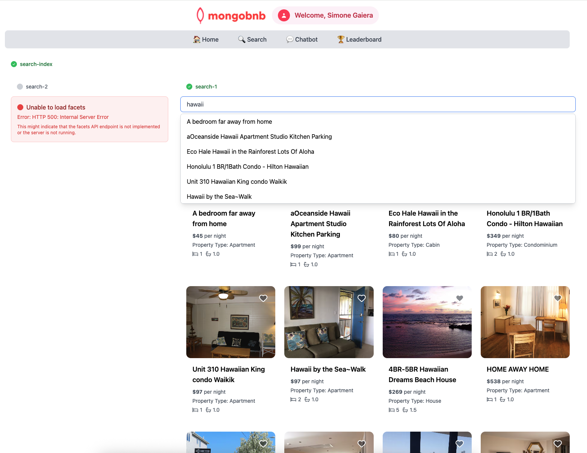

📋 Lab Reference

<strong>Associated Lab File:</strong> <code>search-1.lab.js</code>

## 🚀 Goal: Autocomplete That Wows

Your business wants to make searching for the perfect stay effortless and delightful. Imagine a guest typing just a few letters and instantly seeing smart, typo-tolerant suggestions—helping them find their dream destination in seconds. As the backend engineer, you’re about to bring this magic to life with MongoDB Atlas Search.

Harness the magic of MongoDB Atlas Search to build a slick, lightning-fast autocomplete feature your users will love!

---

### 🧩 Exercise: Autocomplete Like a Pro

1. **Open the File**  
   Head to `server/src/lab/` and open `search-1.lab.js`.

2. **Find the Function**  
   Locate the `autocompleteSearch` function.

3. **Shape the Pipeline**  
   - Add a `$search` stage on the `default` index.  
   - Use `autocomplete` on the `name` field.  
   - Enable `fuzzy` search for typo-tolerant results.  
   - Limit results to 10 documents.  
   - Use `$project` to return only the `name` field.

---

### 🚦 Test Your API

1. Go to `server/src/lab/rest-lab`.  
2. Open `search-1-autocomplete-lab.http`.  
3. Click **Send Request** to call the API.  
4. Confirm the response contains the expected results.
5. **Check Exercise Status:**  
   Go to the app and check if the exercise toggle shows green, indicating your implementation is correct.

---

### 🖥️ Frontend Validation

Type `"hawaii"` in the search bar and watch autocomplete suggestions appear like magic—fast, relevant, and user-friendly!

With this step, you’re not just building a feature—you’re making your users happy and your platform unforgettable.  
**Ready to wow your guests with instant search? Let’s get started!**

