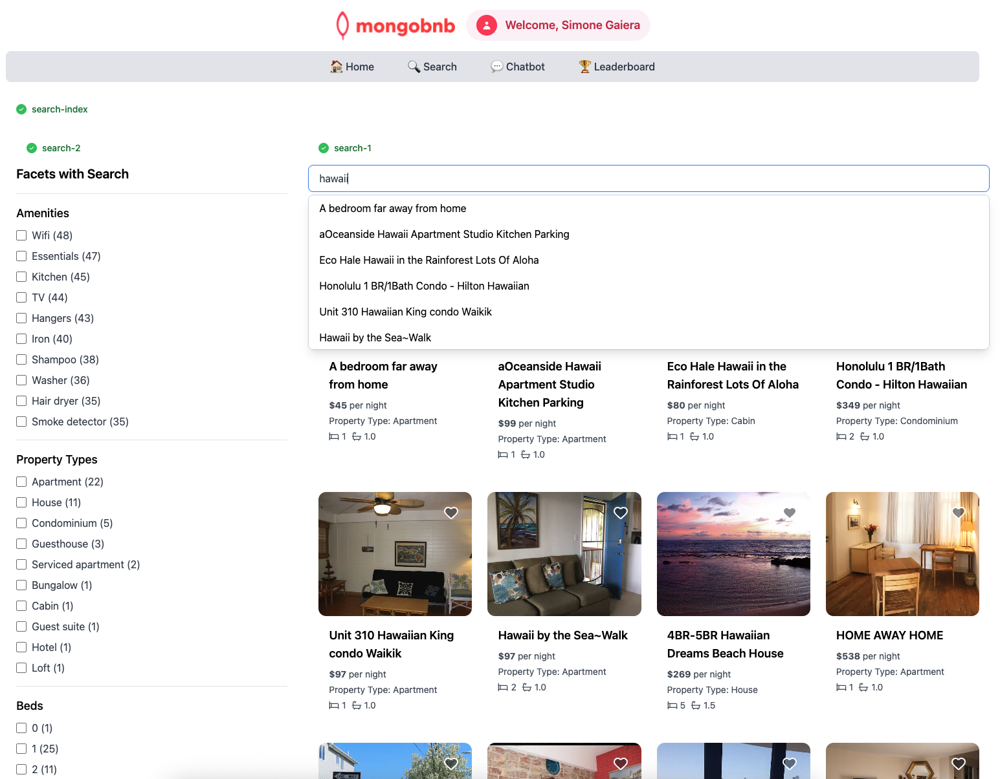

## 🚀 Goal: Faceted Search That Shines

Your platform’s search is already fast and smart, but now your business wants to empower users to explore and filter results with ease. Imagine a guest searching for "hawaii" and instantly narrowing down results by amenities, property type, or number of beds—all with a single click. As the backend engineer, you’re about to make this next-level discovery experience a reality with MongoDB Atlas Search facets.

Faceted search lets your users slice and dice results, making it effortless to find exactly what they want—turning every search into a personalized journey.

---

### 🧩 Exercise: Facets in Action

1. **Open the File**  
   Navigate to `server/src/lab/` and open `search-2.lab.js`.

2. **Locate the Function**  
   Find the `facetSearch` function in the file.

3. **Shape the Pipeline**  
   - Use `$searchMeta` on the `default` index.  
   - Apply `facet` in your pipeline.  
   - For the `operator`, reuse the `autocomplete` search from the previous exercise.  
   - Create these facets:  
     - `amenities`: a string facet  
     - `property_type`: a string facet  
     - `beds`: a numeric facet with boundaries from 0 to 9, and "Other" for any additional values  

---

### 🚦 Test Your API

1. Go to `server/src/lab/rest-lab`.  
2. Open `search-2-lab.http`.  
3. Click **Send Request** to call the API.  
4. Make sure you see valid results in the response.

---

### 🖥️ Frontend Validation

Type `"hawaii"` in the search bar and watch the new facets appear—instantly filter and explore your results!

With this step, you’re not just adding filters—you’re giving your users the power to discover their perfect stay, their way.  
**Ready to make search truly interactive? Let’s get started!**

