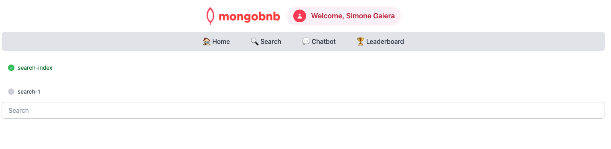

## 🚀 Goal: Supercharge Search with Atlas Search Indexes

Your business wants to delight users with instant, relevant search results and smart suggestions. But before you can deliver that magical experience, you need to lay the foundation: a powerful Atlas Search index. As the backend engineer, you’re setting the stage for autocomplete, faceted navigation, and lightning-fast discovery.

In this exercise, you’ll design and build a custom Atlas Search index—unlocking the full potential of your data and making every search feel effortless for your users.

---

### 🧩 Exercise: Build Your Search Index

Craft your index with these specs:

1. **Basic Configuration**
   - **Name:** `search_index`
   - **Analyzer:** `lucene.english`
   - **Dynamic Mapping:** Off

2. **Field Mappings**
   - **name** (for autocomplete)
     - Type: `autocomplete`
     - Analyzer: `lucene.english`
     - Tokenization: `edgeGram`
     - Min gram: `3`
     - Max gram: `7`
     - Fold Diacritics: `false`
   
   - **amenities** (for filtering)
     - `token` (value: `none`)

   - **property_type** (for filtering)
     - `token` (value: `none`)

   - **beds** (for numeric filtering)
     - `number`

---

### 🛠️ How to Complete This Exercise

Choose your favorite tool and get indexing:
- **MongoDB Atlas** web interface
- **MongoDB Compass**
- **MongoDB Extension** with the provided MongoDB Playground

#### 💻 **Using VS Code?**
- We suggest using the Playground feature for a quick and interactive experience.
- In VSCode Online, locate and open the file `search-index-playground.mongodb.js` (usually found in the bottom left of the Explorer).
  

---

### 🖥️ Frontend Validation

**Check Exercise Status:**  
Go to the app and check if the exercise toggle shows green, indicating your implementation is correct.

---

### 🚦 What to Expect

Once your index is live, your platform will be ready for blazing-fast, full-text search and dynamic filters.  
Autocomplete, faceted navigation, and instant results will be just a query away—delighting your users and setting your app apart.

With this step, you’re not just configuring fields—you’re building the backbone of a world-class search experience.  
**Ready to make your data discoverable? Let’s get started!**
