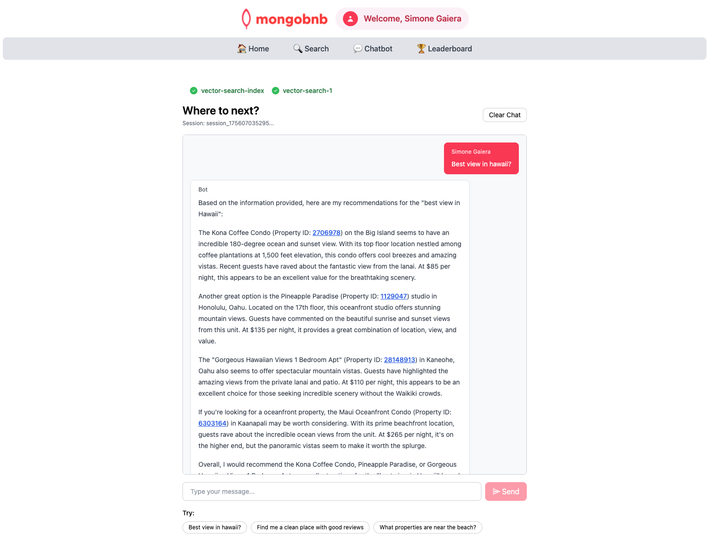

<details>
<summary>📋 Lab Reference</summary>
<p><strong>Associated Lab File:</strong> <code>vector-search-1.lab.js</code></p>
</details>

## 🚀 Goal: Semantic Search That Wows

Your business wants to make searching for the perfect stay effortless and intelligent. Imagine a guest typing a natural-language query and instantly seeing smart, intent-aware suggestions—helping them find their dream destination even if they don’t use the exact words. As the backend engineer, you’re about to bring this next-level search to life with MongoDB Atlas Vector Search.

Harness the power of MongoDB Atlas Vector Search to build a semantic search feature your users will love!

---

### 🧩 Exercise: Semantic Search Like a Pro

1. **Open the File**  
   Head to `server/src/lab/` and open `vector-search-1.lab.js`.

2. **Find the Function**  
   Locate the `vectorSearch` function.

3. **Shape the Pipeline**  
   - Add a `$vectorSearch` stage using your vector index.  
   - Use the `description` field as the vector search path.  
   - Pass the user’s query string as the `query` parameter.  
   - Add a filter on `property_type` for more relevant results.  
   - Set `numCandidates` to 100 and `limit` to 10 in the `$vectorSearch` stage.  

---

### 🚦 Test Your API

1. Go to `server/src/lab/rest-lab`.  
2. Open `vector-search-1-lab.http`.  
3. Click **Send Request** to call the API.  
4. Confirm the response contains the expected, semantically relevant results.
5. **You can also run the tests:**  
   ```bash
   npm test -- --test=vector-search
   ```

---

### 🖥️ Frontend Validation

Type a natural-language query (e.g., `"best view in hawaii"`) in the search bar and watch smart, relevant suggestions appear—powered by AI and vector search!

With this step, you’re not just building a feature—you’re enabling a new era of discovery and delight for your users.  
**Ready to wow your guests with semantic search? Let’s get started!**


