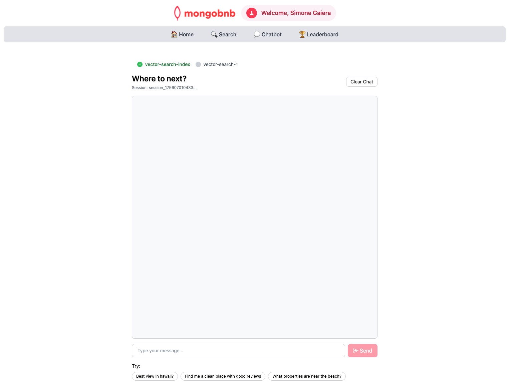

## 🚀 Goal: Enable Semantic Search with Atlas Vector Search Indexes

Your users want smarter, AI-powered search—finding the perfect stay even with natural language queries. To deliver this, you’ll create a **Vector Search index** in MongoDB Atlas. As the backend engineer, you’re building the foundation for semantic search, conversational AI, and next-level discovery.

In this exercise, you’ll configure a vector index that enables semantic search on your listings’ descriptions, using MongoDB’s built-in embedding model, and add a filter field for property type.

---

### 🧩 Exercise: Build Your Vector Search Index

Set up your index with these specs:

- **Index Name:** `vector_index`
- **Text Field Path:** `description`
- **Embedding Model:** `voyage-3-large`
- **Filter Field Path:** `property_type`

---

### 🛠️ How to Complete This Exercise

Choose your favorite tool and get indexing:
- **MongoDB Atlas** web interface
- **MongoDB Compass**
- **MongoDB Extension** with the provided MongoDB Playground

#### 💻 **Using VS Code?**
- We suggest using the Playground feature for a quick and interactive experience.
- In VSCode Online, locate and open the file `vector-search-index-playground.mongodb.js` (usually found in the bottom left of the Explorer).
  

---

### 🖥️ Frontend Validation

**Check Exercise Status:**  
Go to the app and check if the exercise toggle shows green, indicating your implementation is correct.

---

### 🚦 What to Expect

With your vector index live, your platform will be ready for:
- **Semantic search** that understands user intent, not just keywords
- **AI-powered chatbots** that match guest queries to the best listings
- **Faster, more relevant results** with property type filtering
- The foundation for advanced, conversational discovery experiences

You’re not just indexing data—you’re enabling the next generation of search and AI for your platform.  
**Ready to unlock semantic search? Let’s get started!**
