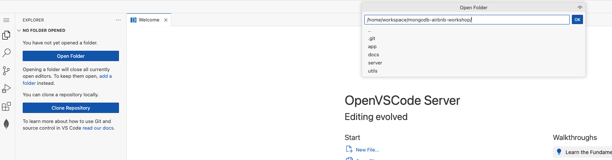

## 🌐💡 VSCode Online: Your Cloud Playground

Welcome to your cloud-powered dev playground!  
Let’s get you connected, coding, and exploring MongoDB in style.

**Quick Check**: Navigate to `https://<customer>.mongogameday.com/` and verify your name appears in the participant list. If it’s not there, please ask your SA before proceeding.

---

## 🔗 Step 1: Supercharge VSCode with Cline

1. **Launch Cline:**  
   - Click the **Cline** icon in the VSCode toolbar to open the extension.
   - Choose **Use your own API key** when prompted.

2. **Configure the API:**
   - Set **API Provider** to **LiteLLM**.
   - Enter the following LiteLLM settings:
     - **Base URL:** `http://litellm-service:4000`
     - **API Key:** `noop`
     - **Model:** `claude-4-sonnet`
     - Select **Use Prompt Caching:**
   - Click **Let's go!**  
     

3. **Save and Test:**
   - Click **Save** to apply your settings.
   - Test your setup by entering a prompt in Cline (for example, ask it to tell you a joke).
     

---

## 🎨 Step 2: Frontend Setup

1. **Launch the App:**
   - Navigate to the Arena Portal and open the `App`

---

## 🚀 Step 3: Backend Setup

1. **Access VSCode Online:**
> **Note:** You can use the default customer page to access your workspace

   - Go to:
     ```
     https://<username>.<customer>.mongogameday.com/
     ```
   - In the `Explorer`, click **Open Folder** and navigate to:
     ```
     /home/workspace/mongodb-airbnb-workshop/backend/
     ```
     Click **Ok**.
       
2. **Trust the Workspace:**
   - When prompted:
     - Click **Yes, I trust the author**
     - Click **Mark Done**
  

---

## 🔗 Step 4: Connect the MongoDB Extension (Optional)

1. **Grab Your Connection String:**  
   - Open `/backend/.env` and copy your MongoDB URI:
     ```markdown
     MONGODB_URI=`mongodb+srv://<username>:<password>@<cluster>.mongodb.net`/?retryWrites=true&w=majority
     ```

2. **Connect in VSCode:**
   - Click the **MongoDB extension** in the sidebar.
   - In **CONNECTIONS**, hit the **+** and choose **Connect with Connection String**.
   - Paste your URI and connect!

3. **Success Check:**
   - If you see your databases, you’re ready to roll!


---

## 🛠️ Troubleshooting

- **Server not starting?**  
  Double-check your terminal commands and directory.

- **Still stuck?**  
  Ping your SA for help—no shame in asking!

---

✨ That’s it! You’re set to code, create, and explore.  
Happy hacking!
