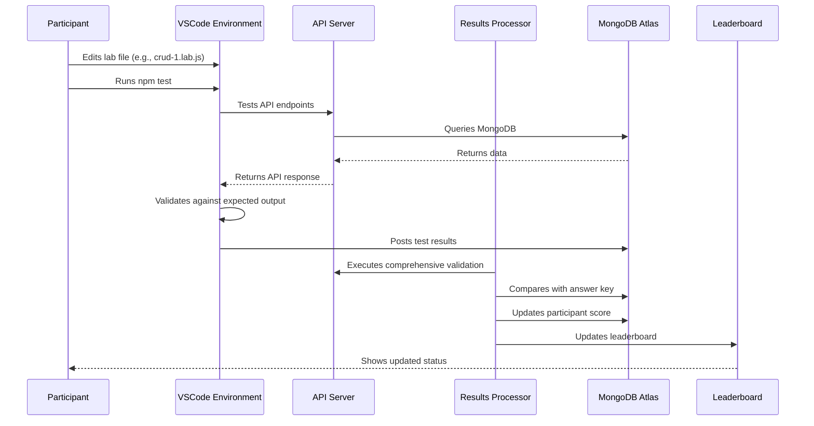

# MongoDB AI Arena Validation Component

## Overview

The validation component in the MongoDB AI Arena is a sophisticated, multi-layered system that combines **real-time testing**, **automated validation**, and **scoring mechanisms** to ensure participants complete MongoDB exercises correctly. The system operates across multiple components to provide comprehensive validation and immediate feedback.

## Architecture Components

### 1. Node.js Test Runner (`saveTestResults.js`)
- Executes Mocha tests locally in the participant's VSCode environment
- Provides immediate feedback on code implementation
- Saves test results to MongoDB for tracking

### 2. Java Results Processor
- Centralized validation service running in Kubernetes
- Executes comprehensive validation tests against participant APIs
- Compares API responses with direct MongoDB queries
- Provides detailed failure analysis and scoring

### 3. MongoDB Storage
- Persistent storage for results and health monitoring
- Tracks participant progress and completion status
- Stores detailed test results and failure reasons

### 4. Frontend Integration
- Real-time status updates and leaderboard
- Visual progress indicators
- Participant feedback and guidance

## Validation Flow



## Dual Validation Approach

### Local Testing (Node.js/Mocha)
- Participants run `npm test` in their VSCode environment
- Mocha executes test files against their API implementations
- Tests validate API responses against expected MongoDB operations
- Results are immediately saved to MongoDB for tracking

### Centralized Validation (Java Results Processor)
- Runs as a Kubernetes service in the EKS cluster
- Executes comprehensive validation tests against participant APIs
- Compares API responses with direct MongoDB queries
- Provides detailed failure analysis and scoring

## Test Execution Framework

### Local Testing (Mocha-based)
- Uses Mocha test framework with BDD-style tests
- Tests are defined in `.test.js` files
- Validates API responses against expected MongoDB operations
- Provides immediate feedback to participants

### Centralized Testing (Java-based)
- Uses specialized test classes for each exercise type
- Implements `BaseTest` abstract class with common functionality
- Each exercise has a dedicated test class (e.g., `Crud1Test`, `Pipeline1Test`)
- Performs comprehensive validation including:
  - HTTP endpoint availability
  - Response format validation
  - Data accuracy comparison
  - Error handling verification

## Exercise Types and Validation

The system validates multiple types of MongoDB exercises:

- **CRUD Operations** (8 exercises): Basic create, read, update, delete operations
- **Aggregation Pipelines** (2 exercises): Complex data analysis and grouping
- **Search Operations** (2 exercises): Text search and faceted search
- **Vector Search** (1 exercise): AI-powered semantic search
- **Index Management** (3 exercises): Database optimization

## Configuration and Setup

### Environment Configuration

#### Scenario Configuration (`scenario.json`)
```json
{
    "version": "1.0",
    "database": { "mongodb": true },
    "llm": {
        "enabled": true,
        "proxy": { "enabled": true, "type": "litellm" }
    },
    "frontend": "app",
    "backend": "server",
    "leaderboard": "timed"
}
```

#### Kubernetes Configuration
- Results Processor runs as a Java Spring Boot application
- Configured via environment variables:
  - `MONGODB_URI`: Database connection string
  - `SERVICE_NAME`: API endpoint to validate
  - `ENVIRONMENT`: Deployment environment
  - `SIGNAL_FILE_PATH`: File watching for triggers

#### Exercise Configuration
- Exercise list defined in `EXERCISE_TESTS` array
- Can be overridden via `scenario_config` MongoDB collection
- Supports dynamic exercise configuration per deployment

### Validation Modes

#### Signal Mode (Production)
- Continuous operation with file watching
- Triggers validation when server restarts
- Polls every hour for new exercises
- Handles concurrency and prevents duplicate executions

#### One-off Mode (Development)
- Single execution for testing
- Immediate validation of all exercises
- Used for development and debugging

### Scoring and Tracking

#### Results Storage
- Results stored in `arena_shared.results` collection
- Health monitoring in `arena_shared.results_health` collection
- Tracks completion status, timestamps, and failure reasons

#### Leaderboard Integration
- Real-time updates via MongoDB queries
- Timed leaderboard with completion tracking
- Participant progress visualization

## Key Features and Capabilities

### Comprehensive Validation
- **API Endpoint Testing**: Validates HTTP responses and status codes
- **Data Accuracy**: Compares API results with direct MongoDB queries
- **Error Handling**: Tests error scenarios and edge cases
- **Performance Monitoring**: Tracks response times and success rates

### Real-time Feedback
- **Immediate Results**: Local testing provides instant feedback
- **Detailed Error Messages**: Specific guidance on what needs to be fixed
- **Progress Tracking**: Visual indicators of completion status
- **Leaderboard Updates**: Real-time ranking and progress display

### Scalability and Reliability
- **Multi-tenant Support**: Isolated environments per participant
- **Concurrent Execution**: Handles multiple participants simultaneously
- **Fault Tolerance**: Continues operation even if individual tests fail
- **Health Monitoring**: Tracks system status and performance

### Flexible Configuration
- **Dynamic Exercise Lists**: Configurable via MongoDB collections
- **Environment-specific Settings**: Different configurations per deployment
- **Custom Validation Rules**: Extensible test framework
- **Integration Points**: Easy integration with external systems

## Configuration Best Practices

1. **Environment Variables**: Ensure all required environment variables are set
2. **MongoDB Connectivity**: Verify database access and permissions
3. **Service Discovery**: Configure proper service names and endpoints
4. **Monitoring**: Set up health checks and logging
5. **Security**: Use proper authentication and network policies

## File Structure

```
server/
├── src/
│   ├── saveTestResults.js          # Node.js test runner
│   ├── lab/                        # Lab exercise files
│   │   ├── crud-1.lab.js
│   │   ├── crud-2.lab.js
│   │   └── ...
│   └── test/                       # Mocha test files
│       ├── crud-1.test.js
│       ├── crud-2.test.js
│       └── ...

utils/eks-cluster/results-processor/
├── src/main/java/com/mongodb/workshop/
│   ├── ResultsProcessor.java       # Main validation service
│   └── tests/                      # Java test classes
│       ├── BaseTest.java
│       ├── Crud1Test.java
│       ├── Pipeline1Test.java
│       └── ...
```

## Usage Examples

### Running Local Tests
```bash
# In the server directory
npm test

# Run specific test
npm test -- --grep "CRUD-1"

# Run with test filter
node src/saveTestResults.js --test="crud-1"
```

### Java Results Processor
```bash
# One-off mode
java -jar results-processor-1.0.0.jar

# Signal mode (production)
# Set SIGNAL_FILE_PATH environment variable
java -jar results-processor-1.0.0.jar
```

## Monitoring and Debugging

### Health Checks
- Results Processor logs health information to `results_health` collection
- Tracks execution status, exercise results, and failure reasons
- Provides detailed error messages for troubleshooting

### Logging
- Comprehensive logging at INFO, WARN, and ERROR levels
- Structured logging with participant identification
- Execution tracking and performance metrics

### Error Handling
- Graceful failure handling with detailed error messages
- Retry mechanisms for transient failures
- Comprehensive validation of all system components

## Conclusion

The validation component is designed to provide a robust, scalable, and user-friendly testing experience that ensures participants learn MongoDB effectively while maintaining high standards of code quality and accuracy. The dual validation approach combines immediate local feedback with comprehensive centralized validation to provide the best learning experience possible.
