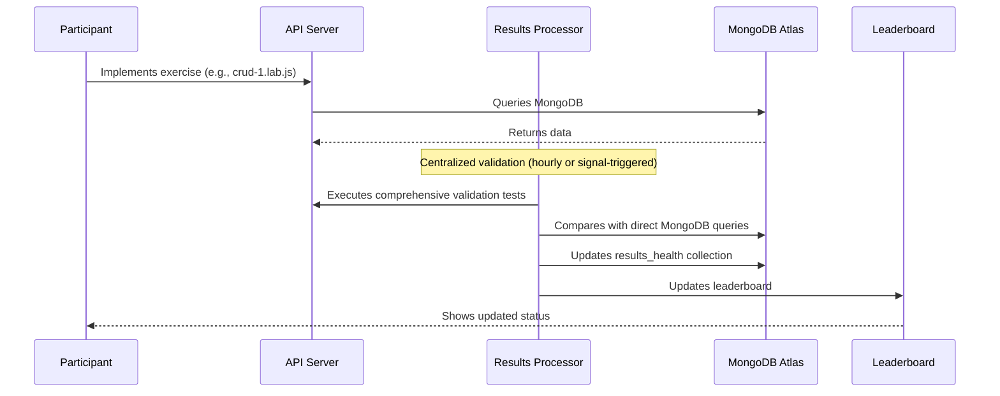

# MongoDB AI Arena Validation Component

## Overview

The validation component in the MongoDB AI Arena is a comprehensive testing system that validates participant implementations through centralized Java-based validation. The system ensures participants complete MongoDB exercises correctly while providing detailed feedback and progress tracking.

## Architecture Components

### 1. Centralized Validation (Java Results Processor)
- **Location**: `utils/eks-cluster/results-processor/`
- **Framework**: Java Spring Boot application
- **Purpose**: Comprehensive validation and scoring
- **Execution**: Runs as Kubernetes service in EKS cluster
- **Validation**: Compares API responses with direct MongoDB queries

### 2. MongoDB Storage
- **Database**: `arena_shared`
- **Collections**:
  - `results` - Stores completed exercise results
  - `results_health` - Tracks validation service health and status
  - `scenario_config` - Dynamic exercise configuration

### 3. Frontend Integration
- Real-time leaderboard updates
- Progress tracking and visualization
- Participant feedback and guidance

## Validation Flow



## Centralized Validation Approach

### Java Results Processor
- **Execution**: Runs as Kubernetes service in EKS cluster
- **Test Classes**: Individual test classes for each exercise type
- **Framework**: Java with MongoDB Java Driver
- **Validation**: Comprehensive comparison of API responses with direct MongoDB queries
- **Storage**: Updates `arena_shared.results_health` collection
- **Modes**: Signal-triggered or hourly polling

## Test Execution Framework

### Centralized Testing Structure
```
utils/eks-cluster/results-processor/
├── src/main/java/com/mongodb/workshop/
│   ├── ResultsProcessor.java   # Main validation service
│   └── tests/                  # Java test classes
│       ├── BaseTest.java       # Abstract base class
│       ├── Crud1Test.java      # CRUD Exercise 1
│       ├── Pipeline1Test.java  # Aggregation Exercise 1
│       └── ...
└── pom.xml                     # Maven configuration
```

## Exercise Types and Validation

The system validates 16 different MongoDB exercises:

### CRUD Operations (8 exercises)
- **crud-1**: Basic find with query, sort, skip, limit
- **crud-2**: FindOne operations
- **crud-3**: Distinct operations
- **crud-4**: Filter operations
- **crud-5**: Insert operations
- **crud-6**: Update operations
- **crud-7**: Reviews aggregation
- **crud-8**: Delete operations

### Aggregation Pipelines (2 exercises)
- **pipeline-1**: Property investment market analysis
- **pipeline-2**: Host analytics aggregation

### Search Operations (2 exercises)
- **search-1**: Autocomplete search
- **search-2**: Faceted search

### Vector Search (1 exercise)
- **vector-search-1**: AI-powered semantic search

### Index Management (3 exercises)
- **crud-index**: CRUD operation indexes
- **search-index**: Search operation indexes
- **vector-search-index**: Vector search indexes

## Configuration and Setup

### Environment Variables

#### Required Variables
- `MONGODB_URI`: MongoDB connection string
- `SERVICE_NAME`: API endpoint to validate
- `ENVIRONMENT`: Deployment environment (prod/test)

#### Optional Variables
- `SIGNAL_FILE_PATH`: File path for signal-triggered execution
- `LOG_LEVEL`: Logging level (INFO/DEBUG/WARN/ERROR)
- `LOG_PATH`: Path for log files

### Signal Mode Configuration
- **Signal File**: `server_restart_signal.txt`
- **Last Processed**: `last_processed_signal.txt`
- **Trigger**: File creation/modification triggers validation
- **Fallback**: Hourly polling if file watching fails

### Exercise Configuration
- **Dynamic**: Exercise list from `scenario_config` collection
- **Fallback**: Hardcoded `EXERCISE_TESTS` array
- **Override**: Can be configured per deployment

## Validation Modes

### Signal Mode (Production)
- **Trigger**: File watching for `server_restart_signal.txt`
- **Execution**: Immediate validation when signal detected
- **Polling**: Hourly fallback if file watching fails
- **Concurrency**: Prevents duplicate executions

### One-off Mode (Development)
- **Trigger**: Manual execution
- **Execution**: Single validation cycle
- **Usage**: Development and debugging

## Test Implementation Details

### BaseTest Class
- **Purpose**: Common functionality for all test classes
- **Features**:
  - HTTP client with SSL trust-all configuration
  - MongoDB database access
  - JSON response parsing
  - Request body creation
  - Test result encapsulation

### Test Result Structure
```java
public static class TestResult {
    private final boolean success;
    private final String errorMessage;
    
    public static TestResult success()
    public static TestResult failure(String errorMessage)
}
```

### Validation Process
1. **HTTP Request**: Make request to participant's API endpoint
2. **Response Validation**: Check HTTP status and response format
3. **MongoDB Query**: Execute equivalent query directly on MongoDB
4. **Comparison**: Compare API response with MongoDB results
5. **Result Storage**: Store results in appropriate collections

## Creating New Tests for Additional Exercises

### Overview
When adding new exercises to the MongoDB AI Arena, you need to create corresponding test classes that extend `BaseTest` and implement the validation logic. This section provides a comprehensive guide for creating robust test implementations.

### Test Class Structure
Every test class must extend `BaseTest` and implement two required methods:
- `getTestName()`: Returns the exercise identifier
- `execute()`: Contains the validation logic

### Example: Simple CRUD Test (Crud2Test)
Here's a complete example of a simple test for finding a single document:

```java
package com.mongodb.workshop.tests;

import com.mongodb.client.MongoCollection;
import com.mongodb.client.MongoDatabase;
import java.net.http.HttpResponse;
import org.bson.Document;
import org.json.JSONObject;

/**
 * Test for: crud-2 (CRUD Exercise 2)
 * Tests the crudOneDocument function implementation
 * Expected: Function should find a single document by _id
 */
public class Crud2Test extends BaseTest {
    
    public Crud2Test(MongoDatabase database, String serviceName, String endpoint) {
        super(database, serviceName, endpoint);
    }
    
    @Override
    public String getTestName() {
        return "crud-2";
    }
    
    @Override
    public TestResult execute() {
        logger.info("Executing CRUD-2 test - Testing crudOneDocument function");
        
        try {
            // 1. Get test data from MongoDB
            MongoCollection<Document> collection = getListingsAndReviewsCollection();
            Document item = collection.aggregate(
                java.util.Arrays.asList(new Document("$sample", new Document("size", 1)))
            ).first();
            
            if (item == null || !item.containsKey("_id")) {
                return TestResult.failure("No documents found in collection");
            }
            
            // 2. Make HTTP request to participant's API
            String itemId = item.get("_id").toString();
            String urlWithId = String.format("%s/%s", endpoint, itemId);
            HttpResponse<String> response = makeLabRequest(urlWithId);
            
            // 3. Validate HTTP response
            if (response.statusCode() != 200) {
                return TestResult.failure("HTTP request failed with status " + response.statusCode());
            }
            
            // 4. Parse and validate response content
            JSONObject result = parseJsonResponse(response.body());
            if (!result.has("_id") || !itemId.equals(result.getString("_id"))) {
                return TestResult.failure("Document ID mismatch");
            }
            
            // 5. Return success
            logger.info("CRUD-2 test passed: Found document with _id '{}'", itemId);
            return TestResult.success();
            
        } catch (Exception e) {
            return TestResult.failure("Test execution failed: " + e.getMessage());
        }
    }
}
```

### Key Components for Building Valid Tests

#### 1. Constructor and Setup
```java
public YourTest(MongoDatabase database, String serviceName, String endpoint) {
    super(database, serviceName, endpoint);
}
```
- **Purpose**: Initialize the test with database connection and API endpoint
- **Parameters**: Provided by the `ResultsProcessor` when creating test instances

#### 2. Test Name Implementation
```java
@Override
public String getTestName() {
    return "your-exercise-name";
}
```
- **Purpose**: Unique identifier for the exercise
- **Format**: Use kebab-case (e.g., "crud-3", "pipeline-1", "search-2")
- **Usage**: Must match the exercise name in `EXERCISE_TESTS` array

#### 3. Test Data Preparation
```java
// Get random document for testing
Document item = collection.aggregate(
    java.util.Arrays.asList(new Document("$sample", new Document("size", 1)))
).first();

// Or get specific test data
List<Document> pipeline = Arrays.asList(
    new Document("$match", new Document("price", new Document("$gt", 100))),
    new Document("$limit", 1)
);
Document item = collection.aggregate(pipeline).first();
```
- **Purpose**: Prepare test data from MongoDB
- **Best Practice**: Use `$sample` for random data or specific queries for deterministic results
- **Validation**: Always check if data exists before proceeding

#### 4. HTTP Request Handling
```java
// GET request
HttpResponse<String> response = makeLabRequest(url);

// POST request with body
Map<String, Object> requestBody = createRequestBody();
requestBody.put("query", "search term");
HttpResponse<String> response = makeLabRequest(endpoint, requestBody);

// Custom HTTP method
HttpResponse<String> response = makeLabRequest(endpoint, requestBody, "PUT");
```
- **Purpose**: Make HTTP requests to participant's API
- **Methods**: `makeLabRequest()` handles GET, POST, PUT, PATCH, DELETE
- **SSL**: Automatically configured with trust-all SSL context

#### 5. Response Validation
```java
// Check HTTP status
if (response.statusCode() != 200) {
    return TestResult.failure("Expected status 200, got " + response.statusCode());
}

// Parse JSON response
JSONObject result = parseJsonResponse(response.body());
JSONArray results = parseJsonArrayResponse(response.body());

// Validate response structure
if (!result.has("requiredField")) {
    return TestResult.failure("Missing required field 'requiredField'");
}
```
- **Purpose**: Validate HTTP response and JSON structure
- **Status Codes**: Check appropriate status codes (200, 201, etc.)
- **JSON Parsing**: Use `parseJsonResponse()` or `parseJsonArrayResponse()`
- **Field Validation**: Check for required fields and data types

#### 6. Data Comparison
```java
// Compare with MongoDB results
Document mongoResult = collection.find(query).first();
JSONObject apiResult = parseJsonResponse(response.body());

if (!mongoResult.getString("field").equals(apiResult.getString("field"))) {
    return TestResult.failure("Field mismatch between API and MongoDB");
}
```
- **Purpose**: Compare API response with expected MongoDB results
- **Accuracy**: Ensure API implementation matches MongoDB behavior
- **Tolerance**: Use appropriate tolerance for numeric comparisons

#### 7. Error Handling and Logging
```java
try {
    // Test logic here
    return TestResult.success();
} catch (Exception e) {
    logger.error("Test failed: {}", e.getMessage());
    return TestResult.failure("Test execution failed: " + e.getMessage());
}
```
- **Purpose**: Handle exceptions gracefully and provide meaningful error messages
- **Logging**: Use `logger.info()`, `logger.warn()`, `logger.error()` for different levels
- **Error Messages**: Provide specific guidance on what went wrong

### Test Categories and Patterns

#### CRUD Operations
- **Pattern**: Simple HTTP requests with MongoDB data comparison
- **Examples**: `Crud1Test`, `Crud2Test`
- **Key Points**: Validate HTTP status, response format, and data accuracy

#### Aggregation Pipelines
- **Pattern**: Complex data processing with detailed result validation
- **Examples**: `Pipeline1Test`, `Pipeline2Test`
- **Key Points**: Validate aggregation results, field presence, and data types

#### Search Operations
- **Pattern**: POST requests with search parameters and result validation
- **Examples**: `Search1Test`, `Search2Test`
- **Key Points**: Validate search results, field projections, and result limits

#### Index Operations
- **Pattern**: Validation of index creation and existence
- **Examples**: `IndexTest`, `SearchIndexTest`
- **Key Points**: Check index existence, configuration, and performance

### Best Practices

#### 1. Test Data Management
- Use `$sample` for random data selection
- Validate data existence before testing
- Use appropriate data filters for specific test scenarios

#### 2. Error Message Quality
- Provide specific, actionable error messages
- Include expected vs actual values in error messages
- Guide participants toward the correct implementation

#### 3. Response Validation
- Check HTTP status codes first
- Validate JSON structure before content
- Use appropriate data type validations

#### 4. Logging and Debugging
- Log test execution steps
- Include relevant data in log messages
- Use appropriate log levels (INFO, WARN, ERROR)

#### 5. Performance Considerations
- Use appropriate timeouts for HTTP requests
- Limit result sets for large data operations
- Handle large responses efficiently

### Integration with ResultsProcessor

#### Adding New Test to EXERCISE_TESTS
```java
private static final List<String> EXERCISE_TESTS = Arrays.asList(
    "crud-1", "crud-2", "crud-3", "crud-4",
    "crud-5", "crud-6", "crud-7", "crud-8",
    "pipeline-1", "pipeline-2",
    "search-1", "search-2",
    "vector-search-1",
    "your-new-exercise"  // Add here
);
```

#### Adding Test Case to createTest()
```java
private BaseTest createTest(String testName, String user) {
    // ... existing cases ...
    case "your-new-exercise":
        return new YourNewTest(database, serviceName, endpoint);
    default:
        return null;
}
```

### Testing Your New Test

#### Local Testing
```bash
# Compile the project
mvn clean compile

# Run specific test
mvn exec:java -Dexec.mainClass="com.mongodb.workshop.ResultsProcessor"
```

#### Validation Checklist
- [ ] Test extends `BaseTest`
- [ ] Implements `getTestName()` and `execute()`
- [ ] Handles HTTP errors gracefully
- [ ] Validates response structure
- [ ] Compares with MongoDB results
- [ ] Provides meaningful error messages
- [ ] Logs execution steps
- [ ] Added to `EXERCISE_TESTS` array
- [ ] Added to `createTest()` method

### Common Pitfalls to Avoid

1. **Missing Error Handling**: Always wrap test logic in try-catch
2. **Inadequate Validation**: Check both structure and content of responses
3. **Poor Error Messages**: Provide specific guidance on what went wrong
4. **Hardcoded Values**: Use dynamic test data from MongoDB
5. **Missing Logging**: Include relevant information in log messages
6. **Incorrect HTTP Methods**: Use appropriate HTTP methods for the operation
7. **Missing Integration**: Ensure test is added to ResultsProcessor configuration

## Scoring and Tracking

### Results Storage
- **Collection**: `arena_shared.results`
- **Document Structure**:
  ```json
  {
    "name": "crud-1",
    "username": "participant_name",
    "timestamp": "2025-01-11T11:42:00.123Z",
    "checksum": "abc123def456"
  }
  ```

### Health Monitoring
- **Collection**: `arena_shared.results_health`
- **Document Structure**:
  ```json
  {
    "_id": "participant_name",
    "version": "1.1.0",
    "environment_info": {
      "environment": "prod",
      "log_level": "INFO",
      "service_name": "api.example.com"
    },
    "exercise_results": [
      {
        "exercise_name": "crud-1",
        "passed": true,
        "failure_reason": null
      }
    ],
    "execution_status": "completed",
    "last_updated": "2025-01-11T11:42:00.123Z",
    "total_exercises": 16,
    "passed_exercises": 12
  }
  ```

### Leaderboard Integration
- Real-time updates via MongoDB queries
- Timed leaderboard with completion tracking
- Participant progress visualization

## Key Features and Capabilities

### Comprehensive Validation
- **API Endpoint Testing**: Validates HTTP responses and status codes
- **Data Accuracy**: Compares API results with direct MongoDB queries
- **Error Handling**: Tests error scenarios and edge cases
- **Performance Monitoring**: Tracks response times and success rates

### Real-time Feedback
- **Detailed Error Messages**: Specific guidance on what needs to be fixed
- **Progress Tracking**: Visual indicators of completion status
- **Leaderboard Updates**: Real-time ranking and progress display

### Scalability and Reliability
- **Multi-tenant Support**: Isolated environments per participant
- **Concurrent Execution**: Handles multiple participants simultaneously
- **Fault Tolerance**: Continues operation even if individual tests fail
- **Health Monitoring**: Tracks system status and performance

### Flexible Configuration
- **Dynamic Exercise Lists**: Configurable via MongoDB collections
- **Environment-specific Settings**: Different configurations per deployment
- **Custom Validation Rules**: Extensible test framework
- **Integration Points**: Easy integration with external systems

## Usage Examples

### Java Results Processor
```bash
# One-off mode
java -jar results-processor-1.0.0.jar

# Signal mode (production)
export SIGNAL_FILE_PATH="/path/to/signals"
java -jar results-processor-1.0.0.jar
```

### Maven Build
```bash
# Compile
mvn clean compile

# Package
mvn clean package

# Run with Maven
mvn exec:java -Dexec.mainClass="com.mongodb.workshop.ResultsProcessor"
```

## Monitoring and Debugging

### Health Checks
- Results Processor logs health information to `results_health` collection
- Tracks execution status, exercise results, and failure reasons
- Provides detailed error messages for troubleshooting

### Logging
- **Framework**: SLF4J with Logback
- **Levels**: INFO, WARN, ERROR with configurable levels
- **Structured Logging**: Participant identification and execution tracking
- **Performance Metrics**: Response times and success rates

### Error Handling
- Graceful failure handling with detailed error messages
- Retry mechanisms for transient failures
- Comprehensive validation of all system components

## File Structure

```
utils/eks-cluster/results-processor/
├── src/main/java/com/mongodb/workshop/
│   ├── ResultsProcessor.java       # Main validation service
│   └── tests/                      # Java test classes
│       ├── BaseTest.java
│       ├── Crud1Test.java
│       ├── Pipeline1Test.java
│       └── ...
├── pom.xml                         # Maven configuration
└── README.md                       # Project documentation
```

## Conclusion

The validation component provides a robust, scalable, and user-friendly testing experience that ensures participants learn MongoDB effectively while maintaining high standards of code quality and accuracy. The centralized validation approach provides comprehensive testing and detailed feedback to support effective learning.

The system is designed to handle multiple participants simultaneously, provide detailed feedback on failures, and maintain comprehensive health monitoring for reliable operation in production environments.