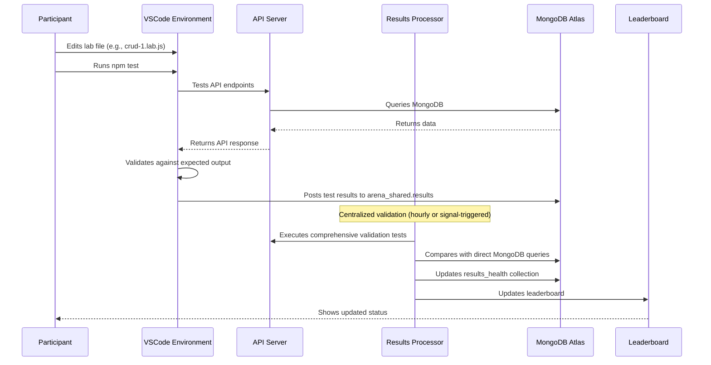

# MongoDB AI Arena Validation Component

## Overview

The validation component in the MongoDB AI Arena is a comprehensive testing system that validates participant implementations through **dual validation approaches**: local Node.js/Mocha testing and centralized Java-based validation. The system ensures participants complete MongoDB exercises correctly while providing immediate feedback and progress tracking.

## Architecture Components

### 1. Local Testing (Node.js/Mocha)
- **File**: `server/src/saveTestResults.js`
- **Framework**: Mocha with BDD-style tests
- **Purpose**: Immediate local feedback for participants
- **Execution**: Participants run `npm test` in their VSCode environment
- **Storage**: Results saved to MongoDB `arena_shared.results` collection

### 2. Centralized Validation (Java Results Processor)
- **Location**: `utils/eks-cluster/results-processor/`
- **Framework**: Java Spring Boot application
- **Purpose**: Comprehensive validation and scoring
- **Execution**: Runs as Kubernetes service in EKS cluster
- **Validation**: Compares API responses with direct MongoDB queries

### 3. MongoDB Storage
- **Database**: `arena_shared`
- **Collections**:
  - `results` - Stores completed exercise results
  - `results_health` - Tracks validation service health and status
  - `scenario_config` - Dynamic exercise configuration

### 4. Frontend Integration
- Real-time leaderboard updates
- Progress tracking and visualization
- Participant feedback and guidance

## Validation Flow



## Dual Validation Approach

### Local Testing (Node.js/Mocha)
- **Execution**: `npm test` in VSCode environment
- **Test Files**: Located in `server/src/test/` directory
- **Framework**: Mocha with BDD-style tests
- **Validation**: Tests API responses against expected MongoDB operations
- **Storage**: Results immediately saved to `arena_shared.results`
- **Feedback**: Real-time console output with pass/fail status

### Centralized Validation (Java Results Processor)
- **Execution**: Runs as Kubernetes service in EKS cluster
- **Test Classes**: Individual test classes for each exercise type
- **Framework**: Java with MongoDB Java Driver
- **Validation**: Comprehensive comparison of API responses with direct MongoDB queries
- **Storage**: Updates `arena_shared.results_health` collection
- **Modes**: Signal-triggered or hourly polling

## Test Execution Framework

### Local Testing Structure
```
server/src/
├── saveTestResults.js          # Main test runner
├── test/                       # Mocha test files
│   ├── crud-1.test.js
│   ├── crud-2.test.js
│   └── ...
└── lab/                        # Lab exercise files
    ├── crud-1.lab.js
    ├── crud-2.lab.js
    └── ...
```

### Centralized Testing Structure
```
utils/eks-cluster/results-processor/
├── src/main/java/com/mongodb/workshop/
│   ├── ResultsProcessor.java   # Main validation service
│   └── tests/                  # Java test classes
│       ├── BaseTest.java       # Abstract base class
│       ├── Crud1Test.java      # CRUD Exercise 1
│       ├── Pipeline1Test.java  # Aggregation Exercise 1
│       └── ...
└── pom.xml                     # Maven configuration
```

## Exercise Types and Validation

The system validates 16 different MongoDB exercises:

### CRUD Operations (8 exercises)
- **crud-1**: Basic find with query, sort, skip, limit
- **crud-2**: FindOne operations
- **crud-3**: Distinct operations
- **crud-4**: Filter operations
- **crud-5**: Insert operations
- **crud-6**: Update operations
- **crud-7**: Reviews aggregation
- **crud-8**: Delete operations

### Aggregation Pipelines (2 exercises)
- **pipeline-1**: Property investment market analysis
- **pipeline-2**: Host analytics aggregation

### Search Operations (2 exercises)
- **search-1**: Autocomplete search
- **search-2**: Faceted search

### Vector Search (1 exercise)
- **vector-search-1**: AI-powered semantic search

### Index Management (3 exercises)
- **crud-index**: CRUD operation indexes
- **search-index**: Search operation indexes
- **vector-search-index**: Vector search indexes

## Configuration and Setup

### Environment Variables

#### Required Variables
- `MONGODB_URI`: MongoDB connection string
- `SERVICE_NAME`: API endpoint to validate
- `ENVIRONMENT`: Deployment environment (prod/test)

#### Optional Variables
- `SIGNAL_FILE_PATH`: File path for signal-triggered execution
- `LOG_LEVEL`: Logging level (INFO/DEBUG/WARN/ERROR)
- `LOG_PATH`: Path for log files

### Signal Mode Configuration
- **Signal File**: `server_restart_signal.txt`
- **Last Processed**: `last_processed_signal.txt`
- **Trigger**: File creation/modification triggers validation
- **Fallback**: Hourly polling if file watching fails

### Exercise Configuration
- **Dynamic**: Exercise list from `scenario_config` collection
- **Fallback**: Hardcoded `EXERCISE_TESTS` array
- **Override**: Can be configured per deployment

## Validation Modes

### Signal Mode (Production)
- **Trigger**: File watching for `server_restart_signal.txt`
- **Execution**: Immediate validation when signal detected
- **Polling**: Hourly fallback if file watching fails
- **Concurrency**: Prevents duplicate executions

### One-off Mode (Development)
- **Trigger**: Manual execution
- **Execution**: Single validation cycle
- **Usage**: Development and debugging

## Test Implementation Details

### BaseTest Class
- **Purpose**: Common functionality for all test classes
- **Features**:
  - HTTP client with SSL trust-all configuration
  - MongoDB database access
  - JSON response parsing
  - Request body creation
  - Test result encapsulation

### Test Result Structure
```java
public static class TestResult {
    private final boolean success;
    private final String errorMessage;
    
    public static TestResult success()
    public static TestResult failure(String errorMessage)
}
```

### Validation Process
1. **HTTP Request**: Make request to participant's API endpoint
2. **Response Validation**: Check HTTP status and response format
3. **MongoDB Query**: Execute equivalent query directly on MongoDB
4. **Comparison**: Compare API response with MongoDB results
5. **Result Storage**: Store results in appropriate collections

## Scoring and Tracking

### Results Storage
- **Collection**: `arena_shared.results`
- **Document Structure**:
  ```json
  {
    "name": "crud-1",
    "username": "participant_name",
    "timestamp": "2025-01-11T11:42:00.123Z",
    "checksum": "abc123def456"
  }
  ```

### Health Monitoring
- **Collection**: `arena_shared.results_health`
- **Document Structure**:
  ```json
  {
    "_id": "participant_name",
    "version": "1.1.0",
    "environment_info": {
      "environment": "prod",
      "log_level": "INFO",
      "service_name": "api.example.com"
    },
    "exercise_results": [
      {
        "exercise_name": "crud-1",
        "passed": true,
        "failure_reason": null
      }
    ],
    "execution_status": "completed",
    "last_updated": "2025-01-11T11:42:00.123Z",
    "total_exercises": 16,
    "passed_exercises": 12
  }
  ```

### Leaderboard Integration
- Real-time updates via MongoDB queries
- Timed leaderboard with completion tracking
- Participant progress visualization

## Key Features and Capabilities

### Comprehensive Validation
- **API Endpoint Testing**: Validates HTTP responses and status codes
- **Data Accuracy**: Compares API results with direct MongoDB queries
- **Error Handling**: Tests error scenarios and edge cases
- **Performance Monitoring**: Tracks response times and success rates

### Real-time Feedback
- **Immediate Results**: Local testing provides instant feedback
- **Detailed Error Messages**: Specific guidance on what needs to be fixed
- **Progress Tracking**: Visual indicators of completion status
- **Leaderboard Updates**: Real-time ranking and progress display

### Scalability and Reliability
- **Multi-tenant Support**: Isolated environments per participant
- **Concurrent Execution**: Handles multiple participants simultaneously
- **Fault Tolerance**: Continues operation even if individual tests fail
- **Health Monitoring**: Tracks system status and performance

### Flexible Configuration
- **Dynamic Exercise Lists**: Configurable via MongoDB collections
- **Environment-specific Settings**: Different configurations per deployment
- **Custom Validation Rules**: Extensible test framework
- **Integration Points**: Easy integration with external systems

## Usage Examples

### Running Local Tests
```bash
# Run all tests
npm test

# Run specific test
npm test -- --grep "CRUD-1"

# Run with test filter
node src/saveTestResults.js --test="crud-1"
```

### Java Results Processor
```bash
# One-off mode
java -jar results-processor-1.0.0.jar

# Signal mode (production)
export SIGNAL_FILE_PATH="/path/to/signals"
java -jar results-processor-1.0.0.jar
```

### Maven Build
```bash
# Compile
mvn clean compile

# Package
mvn clean package

# Run with Maven
mvn exec:java -Dexec.mainClass="com.mongodb.workshop.ResultsProcessor"
```

## Monitoring and Debugging

### Health Checks
- Results Processor logs health information to `results_health` collection
- Tracks execution status, exercise results, and failure reasons
- Provides detailed error messages for troubleshooting

### Logging
- **Framework**: SLF4J with Logback
- **Levels**: INFO, WARN, ERROR with configurable levels
- **Structured Logging**: Participant identification and execution tracking
- **Performance Metrics**: Response times and success rates

### Error Handling
- Graceful failure handling with detailed error messages
- Retry mechanisms for transient failures
- Comprehensive validation of all system components

## File Structure

```
server/
├── src/
│   ├── saveTestResults.js          # Node.js test runner
│   ├── test/                       # Mocha test files
│   │   ├── crud-1.test.js
│   │   ├── crud-2.test.js
│   │   └── ...
│   └── lab/                        # Lab exercise files
│       ├── crud-1.lab.js
│       ├── crud-2.lab.js
│       └── ...

utils/eks-cluster/results-processor/
├── src/main/java/com/mongodb/workshop/
│   ├── ResultsProcessor.java       # Main validation service
│   └── tests/                      # Java test classes
│       ├── BaseTest.java
│       ├── Crud1Test.java
│       ├── Pipeline1Test.java
│       └── ...
├── pom.xml                         # Maven configuration
└── README.md                       # Project documentation
```

## Conclusion

The validation component provides a robust, scalable, and user-friendly testing experience that ensures participants learn MongoDB effectively while maintaining high standards of code quality and accuracy. The dual validation approach combines immediate local feedback with comprehensive centralized validation to provide the best learning experience possible.

The system is designed to handle multiple participants simultaneously, provide detailed feedback on failures, and maintain comprehensive health monitoring for reliable operation in production environments.